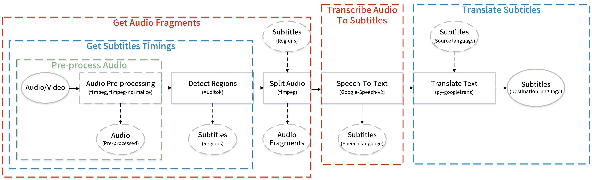

# Autosub

<escape><a href="https://travis-ci.org/BingLingGroup/autosub"></img></a> <a href="https://app.fossa.io/projects/git%2Bgithub.com%2FBingLingGroup%2Fautosub"></img></a></escape>

[简体中文](docs/README.zh-Hans.md)

This repo is not the same as [the original autosub repo](https://github.com/agermanidis/autosub).

This repo has been modified by several people. See the [Changelog](CHANGELOG.md).

<escape></escape>

[autosub icon](docs/icon/autosub.svg) designed by BingLingGroup.

Software: [inkscape](https://inkscape.org/zh/)

Font: [source-han-sans](https://github.com/adobe-fonts/source-han-sans) ([SIL](https://github.com/adobe-fonts/source-han-sans/blob/master/LICENSE.txt))

Color: [Solarized](https://en.wikipedia.org/wiki/Solarized_(color_scheme)#Colors)

### TOC

1. [Description](#description)
2. [License](#license)
3. [Dependencies](#dependencies)
   - 3.1 [Optional Dependencies](#optional-dependencies)
   - 3.2 [Required Dependencies](#required-dependencies)
4. [Download and Installation](#download-and-installation)
   - 4.1 [Branches](#branches)
   - 4.2 [Install on Ubuntu](#install-on-ubuntu)
   - 4.3 [Install on Windows](#install-on-windows)
5. [Workflow](#workflow)
   - 5.1 [Input](#input)
   - 5.2 [Split](#split)
   - 5.3 [Speech-to-Text/Translation API request](#speech-to-texttranslation-api-request)
   - 5.4 [Speech-to-Text/Translation language support](#speech-to-texttranslation-language-support)
   - 5.5 [Output](#Output)
6. [Usage](#usage)
   - 6.1 [Typical usage](#typical-usage)
     - 6.1.1 [Pre-process Audio](#pre-process-audio)
     - 6.1.2 [Detect Regions](#detect-regions)
     - 6.1.3 [Split Audio](#split-audio)
     - 6.1.4 [Transcribe Audio To Subtitles](#transcribe-audio-to-subtitles)
       - 6.1.4.1 [Google Speech V2](#google-speech-v2)
       - 6.1.4.2 [Google Cloud Speech-to-Text](#google-cloud-speech-to-text)
       - 6.1.4.3 [Google speech config](#google-speech-config)
       - 6.1.4.4 [Output API full response](#output-api-full-response)
       - 6.1.4.5 [Xfyun speech config](#xfyun-speech-config)
       - 6.1.4.6 [Baidu speech config](#baidu-speech-config)
     - 6.1.5 [Translate Subtitles](#translate-subtitles)
   - 6.2 [Options](#Options)
   - 6.3 [Internationalization](#internationalization)
7. [FAQ](#FAQ)
   - 7.1 [Other APIs supports](#other-apis-supports)
   - 7.2 [Batch processing](#batch-processing)
   - 7.3 [proxy support](#proxy-support)
   - 7.4 [macOS locale issue](#macos-locale-issue)
   - 7.5 [Accuracy](#accuracy)
8. [Bugs report](#bugs-report)
9. [Build](#build)

Click up arrow to go back to TOC.

### Description

Autosub is an automatic subtitles generating utility. It can detect speech regions automatically by using Auditok, split the audio files according to regions by using ffmpeg, transcribe speech based on several APIs and translate the subtitles' text by using py-googletrans.

The new features mentioned above are only available in the latest alpha branch. Not available on PyPI or the original repo.

### License

This repo has a different license from [the original repo](https://github.com/agermanidis/autosub).

[GPLv3](LICENSE)

[](https://app.fossa.io/projects/git%2Bgithub.com%2FBingLingGroup%2Fautosub)

### Dependencies

Autosub depends on these third party softwares or Python site-packages. Much appreciation to all of these projects.

#### Optional dependencies

- [ffmpeg](https://ffmpeg.org/)
- [ffprobe](https://ffmpeg.org/ffprobe.html)
- [langcodes](https://github.com/LuminosoInsight/langcodes)
- [ffmpeg-normalize](https://github.com/slhck/ffmpeg-normalize)
- [python-Levenshtein](https://github.com/ztane/python-Levenshtein)(Used by [fuzzywuzzy](https://github.com/seatgeek/fuzzywuzzy))

For windows user:

- [Build Tools for Visual Studio 2019](https://visualstudio.microsoft.com/downloads/)
  - Used by [marisa-trie](https://github.com/pytries/marisa-trie) when installing.
  - [marisa-trie](https://github.com/pytries/marisa-trie) is the dependency of the [langcodes](https://github.com/LuminosoInsight/langcodes))
  - Probable components installation: MSVC v14 VS 2019 C++ build tools, windows 10 SDK.

#### Required dependencies

- [auditok 0.1.5](https://github.com/amsehili/auditok)
- [pysubs2](https://github.com/tkarabela/pysubs2)
- [wcwidth](https://github.com/jquast/wcwidth)
- [requests](https://github.com/psf/requests)
- [fuzzywuzzy](https://github.com/seatgeek/fuzzywuzzy)
- [progressbar2](https://github.com/WoLpH/python-progressbar)
- [websocket-client](https://github.com/websocket-client/websocket-client)
- [py-googletrans](https://github.com/ssut/py-googletrans)

[requirements.txt](requirements.txt).

About how to install these dependencies, see [Download and Installation](#download-and-installation).

<escape><a href = "#TOC">&nbsp;↑&nbsp;</a></escape>

### Download and Installation

Except the PyPI version, others include non-original codes not from the original repository.

0.4.0 > autosub

- These versions are only compatible with Python 2.7.

0.5.6a >= autosub >= 0.4.0

- These versions are compatible with both Python 2.7 and Python 3. It don't matter if you change the Python version in the installation commands below.

autosub >= 0.5.7a

- These versions are only compatible with Python 3.

ffmpeg, ffprobe, ffmpeg-normalize need to be put on one of these places to let the autosub detect and use them. The following codes are in the [constants.py](autosub/constants.py). Priority is determined in order.

1. Set the following environment variables before running the program: `FFMPEG_PATH`, `FFPROBE_PATH` and `FFMPEG_NORMALIZE_PATH`. It will override the ones located at the environment variable `PATH`. This will be helpful if you don't want to use the one in the `PATH`.
2. Add them to the environment variable `PATH`. No need to worry about if using package manager to install such as using pip to install ffmpeg-normalize and using chocolatey to install ffmpeg.
3. Add them to the same directory as the autosub executable.
4. Add them to the current command line working directory.

About the git installation. If you don't want to install git to use pip [VCS](https://pip.pypa.io/en/stable/reference/pip_install/#vcs-support) support to install python package or just confused with git environment variables, you can manually click that clone and download button to download the source code and use pip to install the source code [locally](https://pip.pypa.io/en/stable/reference/pip_install/#description) by input these commands.

```batch
cd the_directory_contains_the_source_code
pip install .
```

Due to the autosub PyPI project is maintained by the original autosub repo's owner, I can't modify it or upload a project with the same name. Perhaps later when this version of autosub becomes stabler, I will rename and duplicate this repo and then upload it to PyPI.

#### Branches

[alpha branch](https://github.com/BingLingGroup/autosub/tree/alpha)

- Include many changes from [the original repo](https://github.com/agermanidis/autosub). Details in [Changelog](CHANGELOG.md). Codes will be updated when an alpha version have been released. It is stabler than the dev branch

[origin branch](https://github.com/BingLingGroup/autosub/tree/origin)

- Include the least changes from [the original repo](https://github.com/agermanidis/autosub) except all new features in the [alpha branch](https://github.com/BingLingGroup/autosub/tree/alpha). The changes in [origin branch](https://github.com/BingLingGroup/autosub/tree/dev) just make sure there's no critical bugs when the program is running on Windows. Currently isn't maintained.

[dev branch](https://github.com/BingLingGroup/autosub/tree/dev)

- The latest codes will be pushed to this branch. If it works fine, it will be merged to alpha branch when new version released.
- Only used to test or pull request. Don't install them unless you know what you are doing.

<escape><a href = "#TOC">&nbsp;↑&nbsp;</a></escape>

#### Install on Ubuntu

Include dependencies installation commands.

Install from `alpha` branch.(latest autosub alpha release)

```bash
apt install ffmpeg python python-pip git -y
pip install git+https://github.com/BingLingGroup/autosub.git@alpha ffmpeg-normalize
```

Install from `dev` branch.(latest autosub dev version)

```bash
apt install ffmpeg python python-pip git -y
pip install git+https://github.com/BingLingGroup/autosub.git@dev ffmpeg-normalize langcodes
```

Install from `origin` branch.(autosub-0.4.0a)

```bash
apt install ffmpeg python python-pip git -y
pip install git+https://github.com/BingLingGroup/autosub.git@origin
```

Install from PyPI.(autosub-0.3.12)

```bash
apt install ffmpeg python python-pip -y
pip install autosub
```

Recommend using `python3` and `python-pip3` instead of `python` and `python-pip` after autosub-0.4.0.

<escape><a href = "#TOC">&nbsp;↑&nbsp;</a></escape>

#### Install on Windows

You can just go to the [release page](https://github.com/BingLingGroup/autosub/releases) and download the latest release for Windows. The click-and-run batches are also in the package. You can manually edit by using Notepad++. Or add the executable files' directory to system environment variables so you can use it as a universal command everywhere in the system if permission is Ok.

Tips: `Shift - Right Click` is the keyboard shortcut for opening a Powershell on current directory. To open an exe at current directory, the format is like `.\autosub`.

Or you can just directly open it and input the args manually though I don't recommend doing this due to its less efficiency.

- The one without pyinstaller suffix is compiled by Nuitka. It's faster than the pyinstaller due to its compiling feature different from pyinstaller which just bundles the application.
- ffmpeg and ffmpeg-normalize are also in the package. The original ffmpeg-normalize doesn't have a standalone version. The standalone version of ffmpeg-normalize is built separately. Codes are [here](https://github.com/BingLingGroup/ffmpeg-normalize).
- If there's anything wrong on the both releases, or the package size and any other things are annoying you, you can just use the traditional pip installation method below.

Or install Python environment(if you still don't have one) from choco and then install the package.

Recommend using [chocolatey](https://chocolatey.org) on windows to install the environment and dependencies.

Choco installation command is for cmd.(not Powershell)

```batch
@"%SystemRoot%\System32\WindowsPowerShell\v1.0\powershell.exe" -NoProfile -InputFormat None -ExecutionPolicy Bypass -Command "iex ((New-Object System.Net.WebClient).DownloadString('https://chocolatey.org/install.ps1'))" && SET "PATH=%PATH%;%ALLUSERSPROFILE%\chocolatey\bin"
```

If you don't have visual studio 

Install from `alpha` branch.(latest autosub alpha release)

```batch
choco install git python curl ffmpeg -y
curl https://bootstrap.pypa.io/get-pip.py -o get-pip.py
python get-pip.py
pip install git+https://github.com/BingLingGroup/autosub.git@alpha ffmpeg-normalize langcodes
```

Install from `dev` branch.(latest autosub dev version)

```batch
choco install git python curl ffmpeg -y
curl https://bootstrap.pypa.io/get-pip.py -o get-pip.py
python get-pip.py
pip install git+https://github.com/BingLingGroup/autosub.git@dev ffmpeg-normalize langcodes
```

Install from `origin` branch.(autosub-0.4.0a)

```batch
choco install git python2 curl ffmpeg -y
curl https://bootstrap.pypa.io/get-pip.py -o get-pip.py
python get-pip.py
pip install git+https://github.com/BingLingGroup/autosub.git@origin
```

PyPI version(autosub-0.3.12) is not recommended using on windows because it just can't run successfully. See the [changelog on the origin branch](CHANGELOG.md#040-alpha---2019-02-17) and you will know the details.

Recommend using `python` instead of `python2` autosub-0.4.0.

<escape><a href = "#TOC">&nbsp;↑&nbsp;</a></escape>

### Workflow

#### Input

A video/audio/subtitles file.

If it is a video or audio file, use ffmpeg to convert the format into [the proper one](https://github.com/gillesdemey/google-speech-v2#data) for API. Any format supported by ffmpeg is OK to input, but the output or processed format for API is limited by API and autosub codes.

Supported formats below:

[Google-Speech-v2](https://github.com/gillesdemey/google-speech-v2)

- 24bit/44100Hz/mono FLAC(default)
- Other format like OGG_OPUS isn't supported by API. (I've tried modifying requests headers or json requests and it just didn't work) Or format like PCM has less bits per sample but more storage usage than FLAC. Although the API support it but I think it's unnecessary to modify codes to support it.

[Google Cloud Speech-to-Text API](https://cloud.google.com/speech-to-text/docs/encoding) [v1p1beta1](https://cloud.google.com/speech-to-text/docs/reference/rest/v1p1beta1/RecognitionConfig#AudioEncoding)

- Supported
  - 24bit/44100Hz/mono FLAC(default)
- Supported but not default args (more info on [Transcribe Audio To Subtitles](#transcribe-audio-to-subtitles))
  - 8000Hz|12000Hz|16000Hz|24000Hz|48000Hz/mono OGG_OPUS
  - MP3
  - 16bit/mono PCM

[Xfyun Speech-to-Text WebSocket API](https://www.xfyun.cn/doc/asr/voicedictation/API.html#%E6%8E%A5%E5%8F%A3%E8%A6%81%E6%B1%82)/[Baidu ASR API/Baidu ASR Pro API](https://ai.baidu.com/ai-doc/SPEECH/Vk38lxily)

- Supported
  - 16bit/16000Hz/mono PCM

Also, you can use the built-in audio pre-processing function though Google [doesn't recommend](https://cloud.google.com/speech-to-text/docs/best-practices) doing this. Honestly speaking, if your audio volume is not been standardized like too loud or too quiet, it's recommended to use some tools or just the built-in function to standardize it. The default [pre-processing commands](https://github.com/agermanidis/autosub/issues/40#issuecomment-509928060) depend on the ffmpeg-normalize and ffmpeg. The commands include three commands. The [first](https://trac.ffmpeg.org/wiki/AudioChannelManipulation) is for converting stereo to mono. The [second](https://superuser.com/questions/733061/reduce-background-noise-and-optimize-the-speech-from-an-audio-clip-using-ffmpeg) is for filtering out the sound not in the frequency of speech. The third is to normalize the audio to make sure it is not too loud or too quiet. If you are not satisfied with the default commands, you can also modified them yourself by input `-apc` option. Still, it currently only supports 24bit/44100Hz/mono FLAC format.

If it is a subtitles file and you give the proper arguments, only translate it by py-googletrans.

#### Split

Audio length limits:

[Google-Speech-v2](https://github.com/gillesdemey/google-speech-v2)

- No longer than [10 to 15 seconds](https://github.com/gillesdemey/google-speech-v2#caveats).
- In autosub it is set as the [60-seconds-limit](https://github.com/BingLingGroup/autosub/blob/dev/autosub/constants.py#L74).

[Google Cloud Speech-to-Text API](https://cloud.google.com/speech-to-text/docs/encoding)

- No longer than [1 minute](https://cloud.google.com/speech-to-text/docs/sync-recognize).
- In autosub it is currently set the same as the [60-seconds-limit](https://github.com/BingLingGroup/autosub/blob/dev/autosub/constants.py#L74).
- Currently only support sync-recognize means only short-term audio supported.

[Xfyun Speech-to-Text WebSocket API](https://www.xfyun.cn/doc/asr/voicedictation/API.html#%E6%8E%A5%E5%8F%A3%E8%A6%81%E6%B1%82)/[Baidu ASR API/Baidu ASR Pro API](https://ai.baidu.com/ai-doc/SPEECH/Vk38lxily)

- Same limit above.

Autosub uses Auditok to detect speech regions. And then use them to split as well as convert the video/audio into many audio fragments. Each fragment per region per API request. All these audio fragments are converted directly from input to avoid any extra quality loss.

Or uses external regions from the file that pysubs2 supports like `.ass` or `.srt`. This will allow you to manually adjust the regions to get better recognition result.

#### Speech-to-Text/Translation API request

Makes parallel requests to generate transcriptions for those regions. One audio fragment per request. Recognition speed mostly depends on your network upload speed.

- Manually post-processing for the subtitles lines may be needed, some of which are too long to be fitted in a single line at the bottom of the video frame.

After Speech-to-Text, translates them to a different language. Combining multiple lines of text to a chunk of text to request for result. Details at [issue #49](https://github.com/BingLingGroup/autosub/issues/49). And finally saves the result subtitles to the local storage.

<escape><a href = "#TOC">&nbsp;↑&nbsp;</a></escape>

#### Speech-to-Text/Translation language support

Below is only for Google API language codes description. About other API: [Xfyun speech config](#xfyun-speech-config), [baidu speech config](#baidu-speech-config).

The Speech-to-Text lang codes are different from the Translation lang codes due to the difference between these two APIs. And of course, they are in *Google* formats, not following the iso standards, making users more confused to use.

To solve this problem, autosub uses [langcodes](https://github.com/LuminosoInsight/langcodes) to detect input lang code and convert it to a best match according to the lang code lists. Default it won't be enabled. To enable it in different phases, use `-bm all` option.

To manually match or see the full list of the lang codes, run the utility with the argument `-lsc`/`--list-speech-codes` and `-ltc`/ `--list-translation-codes`. Or open [constants.py](autosub/constants.py) and check.

To get the language of the first line of the subtitles file, you can use `-dsl` to detect.

- Currently, autosub allows to send the lang codes not from the `--list-speech-codes`, which means in this case the program won't stop.

- Though you can input the speech lang code whatever you want, need to point out that if not using the codes on the list but somehow the API accept it, [Google-Speech-v2](https://github.com/gillesdemey/google-speech-v2) recognizes your audio in the ways that depend on your IP address which is uncontrollable by yourself. This is a known issue and I ask for a [pull request](https://github.com/agermanidis/autosub/pull/136) in the original repo.

- On the other hand, [py-googletrans](https://github.com/ssut/py-googletrans) is stricter. When it receive a lang code not on its list, it will throw an exception and stop translation.

- Apart from the user input, another notable change is I split the `-S` option into two parts, `-S` and `-SRC`. `-S` option is for speech recognition lang code. `-SRC` is for translation source language. When not offering the arg of `-SRC`, autosub will automatically match the `-S` arg by using [langcodes](https://github.com/LuminosoInsight/langcodes) and get a best-match lang code for translation source language though [py-googletrans](https://github.com/ssut/py-googletrans) can auto-detect source language. Of course you can manually specify one by input `-SRC` option. `-D` is for translation destination language, still the same as before.

<escape><a href = "#TOC">&nbsp;↑&nbsp;</a></escape>

#### Output

Currently support the following formats to output.

```Python
OUTPUT_FORMAT = {
    'srt': 'SubRip',
    'ass': 'Advanced SubStation Alpha',
    'ssa': 'SubStation Alpha',
    'sub': 'MicroDVD Subtitle',
    'mpl2.txt': 'Similar to MicroDVD',
    'tmp': 'TMP Player Subtitle Format',
    'vtt': 'WebVTT',
    'json': 'json(Only times and text)',
    'ass.json': 'json(Complex ass content json)',
    'txt': 'Plain Text(Text or times)'
}
```

Or other subtitles types/output modes, depend on what you need. More info in help message.

```Python
DEFAULT_MODE_SET = {
    'regions',
    'src',
    'full-src',
    'dst',
    'bilingual',
    'dst-lf-src',
    'src-lf-dst'
}
```

<escape><a href = "#TOC">&nbsp;↑&nbsp;</a></escape>

### Usage

For the original autosub usage, see [简体中文使用指南](https://binglinggroup.github.io/archives/autosub安装使用指南(windows及ubuntu).html).

For the modified alpha branch version, see the typical usage below.

#### Typical usage

<escape><div title="Typical usage" align="middle"></div></escape>

##### Pre-process Audio

Use default [Audio pre-processing](https://github.com/agermanidis/autosub/issues/40).

Pre-processing only.

```
autosub -i input_file -ap o
```

Pre-processing as a part.

```
autosub -i input_file -ap y ...(other options)
```

##### Detect Regions

Detect regions by using Auditok.

Getting regions only.

```
autosub -i input_file
```

Getting regions as a part.

```
autosub -i input_file -of regions ...(other options)
```

<escape><a href = "#TOC">&nbsp;↑&nbsp;</a></escape>

##### Split Audio

Get audio fragments according to the regions.

Only get audio fragments according to auto regions detection.

```
autosub -i input_file -ap s
```

Only get audio fragments according to external regions.

```
autosub -i input_file -ap s -er external_regions_subtitles
```

Getting audio fragments as a part.

```
autosub -i input_file -k ...(other options)
```

##### Transcribe Audio To Subtitles

Speech audio fragments to speech language subtitles.

###### Google Speech V2

Use default [Google-Speech-v2](https://github.com/gillesdemey/google-speech-v2) to transcribe speech language subtitles only.

```
autosub -i input_file -S lang_code
```

Use default [Google-Speech-v2](https://github.com/gillesdemey/google-speech-v2) to transcribe speech language subtitles as a part.

```
autosub -i input_file -S lang_code -of src ...(other options)
```

<escape><a href = "#TOC">&nbsp;↑&nbsp;</a></escape>

###### Google Cloud Speech-to-Text

Use Google Cloud Speech-to-Text API service account(GOOGLE_APPLICATION_CREDENTIALS has already been set in system environment variable) to transcribe.

```
autosub -i input_file -sapi gcsv1 -S lang_code ...(other options)
```

Use Google Cloud Speech-to-Text API service account(GOOGLE_APPLICATION_CREDENTIALS is set by `-sa`) to transcribe.(Currently not available in Nuitka build.)

```
autosub -i input_file -sapi gcsv1 -S lang_code -sa path_to_key_file ...(other options)
```

Use Google Cloud Speech-to-Text API key to transcribe.

```
autosub -i input_file -sapi gcsv1 -S lang_code -skey API_key ...(other options)
```

Use 48000Hz OGG_OPUS in Google Cloud Speech-to-Text API. The conversion commands will be automatically modified by these [codes](https://github.com/BingLingGroup/autosub/blob/alpha/autosub/__init__.py#L135-L140).

```
autosub -i input_file -sapi gcsv1 -asf .ogg -asr 48000 ...(other options)
```

Use MP3 in Google Cloud Speech-to-Text API.(Not recommended because OGG_OPUS is better than MP3)
```
autosub -i input_file -sapi gcsv1 -asf .mp3 ...(other options)
```

<escape><a href = "#TOC">&nbsp;↑&nbsp;</a></escape>

###### Google Speech config

Use customized [speech config file](https://googleapis.dev/python/speech/latest/gapic/v1/types.html#google.cloud.speech_v1.types.RecognitionConfig) to send request to Google Cloud Speech API. If using the config file, override these options: `-S`, `-asr`, `-asf`.

`language_code` will be replaced by the best matching one if using option `-bm src` or `-bm all`. `encoding` string will be replaced by the enum in `google.cloud.speech_v1p1beta1.enums.RecognitionConfig.AudioEncoding` if using service account credentials. Default `encoding` is `FLAC`. Default `sample_rate_hertz` is `44100`.

Example speech config file:

```json
{
    "language_code": "zh",
    "enable_word_time_offsets": true
}
```

If not provide option `-asr` and `-asf`, equal to:

```json
{
    "language_code": "zh",
    "sample_rate_hertz": 44100,
    "encoding": "FLAC",
    "enable_word_time_offsets": true
}
```

otherwise:

```json
{
    "language_code": "zh",
    "sample_rate_hertz": "from --api-sample-rate",
    "encoding": "from --api-suffix",
    "enable_word_time_offsets": true
}
```

command:

```
autosub -i input_file -sconf config_json_file -bm all -sapi gcsv1 -skey API_key ...(other options)
```

<escape><a href = "#TOC">&nbsp;↑&nbsp;</a></escape>

###### Output API full response

Currently autosub can't handle many [advanced fields](https://cloud.google.com/speech-to-text/docs/reference/rpc/google.cloud.speech.v1p1beta1#google.cloud.speech.v1p1beta1.SpeechRecognitionResult) contained in the speech recognition result received from API, especially from Google Cloud Speech-to-Text API. With complex [speech config](#speech-config) input and option `-of full-src`, recognition results will be output into json file so you can customize them and handle them outside autosub.

Example json output:

```json
[
    {
        "start": 0.52,
        "end": 1.31,
        "content": {
            "results": [
                {
                    "alternatives": [
                        {
                            "confidence": 0.98267895,
                            "transcript": "how old is the Brooklyn Bridge"
                        }
                    ]
                }
            ]
        }
    }
]
```

"start" and "end" mean the start seconds and the end seconds in the whole audio file. "content" is the result received from API.

command:

```
autosub -i input_file -sconf config_json_file -bm all -sapi gcsv1 -skey API_key -of full-src ...(other options)
```

<escape><a href = "#TOC">&nbsp;↑&nbsp;</a></escape>

##### Xfyun speech config

For Xfyun Speech-to-Text WebSocket API usage, user must input its speech config.

Example speech config file:

```json
{
    "app_id": "",
    "api_secret": "",
    "api_key": "",
    "business": {
        "language": "zh_cn",
        "domain": "iat",
        "accent": "mandarin"
    }
}
```

`"business"` field is the same as the [xfyun document](https://www.xfyun.cn/doc/asr/voicedictation/API.html#%E4%B8%9A%E5%8A%A1%E5%8F%82%E6%95%B0) mentioned.

When the file doesn't include the `"business"` field, autosub will use the above default content instead.

If you add `"delete_chars": "，。"` in the configuration file (In this example, full-width comma and period are the punctuations to be deleted), autosub will automatically replace the specific punctuation with a space when receiving the transcript, and strip the space at the end of each sentence.

command:

```
autosub -sapi xfyun -i input_file -sconf xfyun_speech_config ...(other options)
```

##### Baidu speech config

For Baidu ASR API usage, user must input its speech config.

Example speech config file:

```json
{
    "AppID": "",
    "API key": "",
    "Secret Key": "",
    "config": {
        "format": "pcm",
        "rate": 16000,
        "channel": 1,
        "cuid": "python",
        "dev_pid": 1537
    }
}
```

`"config"` field is the same as the [Baidu ASR document](https://ai.baidu.com/ai-doc/SPEECH/ek38lxj1u) mentioned.

If you want to use the Pro ASR API, change the value of `"cuid"` into `80001`.

When the file doesn't include the `"config"` field, autosub will use the above default content instead.

Same `"delete_chars"` function above.

Practical speaking, since Baidu ASR/ASR Pro API doesn't allow concurrency by default, concurrency will be limited to 1. If you need to lift the limit, please add `"disable_qps_limit": true,` to the config file. If so, the concurrency will be set by the option `-sc`.

command:

```
autosub -sapi baidu -i input_file -sconf baidu_speech_config ...(other options)
```

<escape><a href = "#TOC">&nbsp;↑&nbsp;</a></escape>

##### Translate Subtitles

Translate subtitles to another language.

If not input option `-SRC`, the translation source language will be auto-detected by py-googletrans.

Translate subtitles from an audio/video file.

```
autosub -i input_file -S lang_code (-SRC lang_code) -D lang_code
```

Translate subtitles from a subtitles file.(Translation source language auto-detection by py-googletrans)

```
autosub -i input_file -SRC lang_code -D lang_code
```

Translate subtitles by "translate.google.cn" which can be directly accessed from somewhere.

```
autosub -i input_file -surl "translate.google.cn" ...(other options)
```

<escape><a href = "#TOC">&nbsp;↑&nbsp;</a></escape>

#### Options

Full list of the help message.

```
$ autosub -h
usage:
  autosub [-i path] [options]

Auto-generate subtitles for video/audio/subtitles file.

Input Options:
  Options to control input.

  -i path, --input path
                        The path to the video/audio/subtitles file that needs
                        to generate subtitles. When it is a subtitles file,
                        the program will only translate it. (arg_num = 1)
  -er path, --ext-regions path
                        Path to the subtitles file which provides external
                        speech regions, which is one of the formats that
                        pysubs2 supports and overrides the default method to
                        find speech regions. (arg_num = 1)
  -sty [path], --styles [path]
                        Valid when your output format is "ass"/"ssa". Path to
                        the subtitles file which provides "ass"/"ssa" styles
                        for your output. If the arg_num is 0, it will use the
                        styles from the : "-esr"/"--external-speech-regions".
                        More info on "-sn"/"--styles-name". (arg_num = 0 or 1)
  -sn [style_name [style_name ...]], --styles-name [style_name [style_name ...]]
                        Valid when your output format is "ass"/"ssa" and
                        "-sty"/"--styles" is given. Adds "ass"/"ssa" styles to
                        your events. If not provided, events will use the
                        first one from the file. If the arg_num is 1, events
                        will use the specific style from the arg of "-sty"/"--
                        styles". If the arg_num is 2, src language events use
                        the first. Dst language events use the second.
                        (arg_num = 1 or 2)

Language Options:
  Options to control language.

  -S lang_code, --speech-language lang_code
                        Lang code/Lang tag for speech-to-text. Recommend using
                        the Google Cloud Speech reference lang codes. WRONG
                        INPUT WON'T STOP RUNNING. But use it at your own risk.
                        Ref: https://cloud.google.com/speech-to-
                        text/docs/languages(arg_num = 1) (default: None)
  -SRC lang_code, --src-language lang_code
                        Lang code/Lang tag for translation source language. If
                        not given, use py-googletrans to auto-detect the src
                        language. (arg_num = 1) (default: auto)
  -D lang_code, --dst-language lang_code
                        Lang code/Lang tag for translation destination
                        language. (arg_num = 1) (default: None)
  -bm [mode [mode ...]], --best-match [mode [mode ...]]
                        Use langcodes to get a best matching lang code when
                        your input is wrong. Only functional for py-
                        googletrans and Google Speech API. If langcodes not
                        installed, use fuzzywuzzy instead. Available modes: s,
                        src, d, all. "s" for "-S"/"--speech-language". "src"
                        for "-SRC"/"--src-language". "d" for "-D"/"--dst-
                        language". (3 >= arg_num >= 1)
  -mns integer, --min-score integer
                        An integer between 0 and 100 to control the good match
                        group of "-lsc"/"--list-speech-codes" or "-ltc"/"--
                        list-translation-codes" or the match result in "-bm"/"
                        --best-match". Result will be a group of "good match"
                        whose score is above this arg. (arg_num = 1)

Output Options:
  Options to control output.

  -o path, --output path
                        The output path for subtitles file. (default: the
                        "input" path combined with the proper name tails)
                        (arg_num = 1)
  -F format, --format format
                        Destination subtitles format. If not provided, use the
                        extension in the "-o"/"--output" arg. If "-o"/"--
                        output" arg doesn't provide the extension name, use
                        "srt" instead. In this case, if "-i"/"--input" arg is
                        a subtitles file, use the same extension from the
                        subtitles file. (arg_num = 1) (default: srt)
  -y, --yes             Prevent pauses and allow files to be overwritten. Stop
                        the program when your args are wrong. (arg_num = 0)
  -of [type [type ...]], --output-files [type [type ...]]
                        Output more files. Available types: regions, src,
                        full-src, dst, bilingual, dst-lf-src, src-lf-dst, all.
                        "regions", "src", "full-src" are available only if
                        input is not a subtitles file. full-src: Full result
                        received from Speech-to-Text API in json format with
                        start and end time. dst-lf-src: dst language and src
                        language in the same event. And dst is ahead of src.
                        src-lf-dst: src language and dst language in the same
                        event. And src is ahead of dst. (6 >= arg_num >= 1)
                        (default: ['dst'])
  -fps float, --sub-fps float
                        Valid when your output format is "sub". If input, it
                        will override the fps check on the input file. Ref:
                        https://pysubs2.readthedocs.io/en/latest/api-
                        reference.html#supported-input-output-formats (arg_num
                        = 1)

Speech Options:
  Options to control speech-to-text. If Speech Options not given, it will only generate the times.

  -sapi API_code, --speech-api API_code
                        Choose which Speech-to-Text API to use. Currently
                        support: gsv2: Google Speech V2
                        (https://github.com/gillesdemey/google-speech-v2).
                        gcsv1: Google Cloud Speech-to-Text V1P1Beta1
                        (https://cloud.google.com/speech-to-text/docs). xfyun:
                        Xun Fei Yun Speech-to-Text WebSocket API (https://www.
                        xfyun.cn/doc/asr/voicedictation/API.html). baidu:
                        Baidu Automatic Speech Recognition API
                        (https://ai.baidu.com/ai-doc/SPEECH/Vk38lxily)
                        (arg_num = 1) (default: gsv2)
  -skey key, --speech-key key
                        The API key for Google Speech-to-Text API. (arg_num =
                        1) Currently support: gsv2: The API key for gsv2.
                        (default: Free API key) gcsv1: The API key for gcsv1.
                        (If used, override the credentials given by"-sa"/"--
                        service-account")
  -sconf [path], --speech-config [path]
                        Use Speech-to-Text recognition config file to send
                        request. Override these options below: "-S", "-asr",
                        "-asf". Currently support: gcsv1: Google Cloud Speech-
                        to-Text V1P1Beta1 API key config reference:
                        https://cloud.google.com/speech-to-
                        text/docs/reference/rest/v1p1beta1/RecognitionConfig
                        Service account config reference: https://googleapis.d
                        ev/python/speech/latest/gapic/v1/types.html#google.clo
                        ud.speech_v1.types.RecognitionConfig xfyun: Xun Fei
                        Yun Speech-to-Text WebSocket API
                        (https://console.xfyun.cn/services/iat). baidu: Baidu
                        Automatic Speech Recognition API
                        (https://ai.baidu.com/ai-doc/SPEECH/ek38lxj1u). If
                        arg_num is 0, use const path. (arg_num = 0 or 1)
                        (const: config.json)
  -mnc float, --min-confidence float
                        Google Speech-to-Text API response for text
                        confidence. A float value between 0 and 1. Confidence
                        bigger means the result is better. Input this argument
                        will drop any result below it. Ref:
                        https://github.com/BingLingGroup/google-
                        speech-v2#response (arg_num = 1) (default: 0.0)
  -der, --drop-empty-regions
                        Drop any regions without speech recognition result.
                        (arg_num = 0)
  -sc integer, --speech-concurrency integer
                        Number of concurrent Speech-to-Text requests to make.
                        (arg_num = 1) (default: 4)

py-googletrans Options:
  Options to control translation. Default method to translate. Could be blocked at any time.

  -slp second, --sleep-seconds second
                        (Experimental)Seconds to sleep between two translation
                        requests. (arg_num = 1) (default: 1)
  -surl [URL [URL ...]], --service-urls [URL [URL ...]]
                        (Experimental)Customize request urls. Ref: https://py-
                        googletrans.readthedocs.io/en/latest/ (arg_num >= 1)
  -ua User-Agent headers, --user-agent User-Agent headers
                        (Experimental)Customize User-Agent headers. Same docs
                        above. (arg_num = 1)
  -doc, --drop-override-codes
                        Drop any .ass override codes in the text before
                        translation. Only affect the translation result.
                        (arg_num = 0)
  -gt-dc [chars], --gt-delete-chars [chars]
                        Replace the specific chars with a space after
                        translation, and strip the space at the end of each
                        sentence. Only affect the translation result. (arg_num
                        = 0 or 1) (const: ，。！)

Subtitles Conversion Options:
  Options to control subtitles conversions.(Experimental)

  -mjs integer, --max-join-size integer
                        (Experimental)Max length to join two events. (arg_num
                        = 1) (default: 100)
  -mdt second, --max-delta-time second
                        (Experimental)Max delta time to join two events.
                        (arg_num = 1) (default: 0.2)
  -dms string, --delimiters string
                        (Experimental)Delimiters not to join two events.
                        (arg_num = 1) (default: !()*,.:;?[]^_`~)
  -sw1 words_delimited_by_space, --stop-words-1 words_delimited_by_space
                        (Experimental)First set of Stop words to split two
                        events. (arg_num = 1)
  -sw2 words_delimited_by_space, --stop-words-2 words_delimited_by_space
                        (Experimental)Second set of Stop words to split two
                        events. (arg_num = 1)
  -ds, --dont-split     (Experimental)Don't Split just merge. (arg_num = 0)

Network Options:
  Options to control network.

  -hsa, --http-speech-api
                        Change the Google Speech V2 API URL into the http one.
                        (arg_num = 0)
  -hsp [URL], --https-proxy [URL]
                        Add https proxy by setting environment variables. If
                        arg_num is 0, use const proxy url. (arg_num = 0 or 1)
                        (const: https://127.0.0.1:1080)
  -hp [URL], --http-proxy [URL]
                        Add http proxy by setting environment variables. If
                        arg_num is 0, use const proxy url. (arg_num = 0 or 1)
                        (const: http://127.0.0.1:1080)
  -pu username, --proxy-username username
                        Set proxy username. (arg_num = 1)
  -pp password, --proxy-password password
                        Set proxy password. (arg_num = 1)

Other Options:
  Other options to control.

  -h, --help            Show autosub help message and exit. (arg_num = 0)
  -V, --version         Show autosub version and exit. (arg_num = 0)
  -sa path, --service-account path
                        Set service account key environment variable. It
                        should be the file path of the JSON file that contains
                        your service account credentials. Can be overridden by
                        the API key. Ref:
                        https://cloud.google.com/docs/authentication/getting-
                        started Currently support: gcsv1
                        (GOOGLE_APPLICATION_CREDENTIALS) (arg_num = 1)

Audio Processing Options:
  Options to control audio processing.

  -ap [mode [mode ...]], --audio-process [mode [mode ...]]
                        Option to control audio process. If not given the
                        option, do normal conversion work. "y": pre-process
                        the input first then start normal workflow. If
                        succeed, no more conversion before the speech-to-text
                        procedure. "o": only pre-process the input audio.
                        ("-k"/"--keep" is true) "s": only split the input
                        audio. ("-k"/"--keep" is true) Default command to pre-
                        process the audio: C:\Program
                        Files\ImageMagick-7.0.10-Q16\ffmpeg.exe -hide_banner
                        -i "{in_}" -vn -af "asplit[a],aphasemeter=video=0,amet
                        adata=select:key=lavfi.aphasemeter.phase:value=-0.005:
                        function=less,pan=1c|c0=c0,aresample=async=1:first_pts
                        =0,[a]amix" -ac 1 -f flac -loglevel error "{out_}" |
                        C:\Program Files\ImageMagick-7.0.10-Q16\ffmpeg.exe
                        -hide_banner -i "{in_}" -af
                        "lowpass=3000,highpass=200" -loglevel error "{out_}" |
                        C:\Python37\Scripts\ffmpeg-normalize.exe -v "{in_}"
                        -ar 44100 -ofmt flac -c:a flac -pr -p -o "{out_}"
                        (Ref: https://github.com/stevenj/autosub/blob/master/s
                        cripts/subgen.sh https://ffmpeg.org/ffmpeg-
                        filters.html) (2 >= arg_num >= 1)
  -k, --keep            Keep audio processing files to the output path.
                        (arg_num = 0)
  -apc [command [command ...]], --audio-process-cmd [command [command ...]]
                        This arg will override the default audio pre-process
                        command. Every line of the commands need to be in
                        quotes. Input file name is {in_}. Output file name is
                        {out_}. (arg_num >= 1)
  -ac integer, --audio-concurrency integer
                        Number of concurrent ffmpeg audio split process to
                        make. (arg_num = 1) (default: 4)
  -acc command, --audio-conversion-cmd command
                        (Experimental)This arg will override the default audio
                        conversion command. "[", "]" are optional arguments
                        meaning you can remove them. "{", "}" are required
                        arguments meaning you can't remove them. (arg_num = 1)
                        (default: C:\Program
                        Files\ImageMagick-7.0.10-Q16\ffmpeg.exe -hide_banner
                        -y -i "{in_}" -vn -ac {channel} -ar {sample_rate}
                        -loglevel error "{out_}")
  -asc command, --audio-split-cmd command
                        (Experimental)This arg will override the default audio
                        split command. Same attention above. (arg_num = 1)
                        (default: C:\Program
                        Files\ImageMagick-7.0.10-Q16\ffmpeg.exe -y -ss {start}
                        -i "{in_}" -t {dura} -vn -ac [channel] -ar
                        [sample_rate] -loglevel error "{out_}")
  -asf file_suffix, --api-suffix file_suffix
                        (Experimental)This arg will override the default API
                        audio suffix. (arg_num = 1) (default: .flac)
  -asr sample_rate, --api-sample-rate sample_rate
                        (Experimental)This arg will override the default API
                        audio sample rate(Hz). (arg_num = 1) (default: 44100)
  -aac channel_num, --api-audio-channel channel_num
                        (Experimental)This arg will override the default API
                        audio channel. (arg_num = 1) (default: 1)

Auditok Options:
  Options to control Auditok when not using external speech regions control.

  -et energy, --energy-threshold energy
                        The energy level which determines the region to be
                        detected. Ref: https://auditok.readthedocs.io/en/lates
                        t/apitutorial.html#examples-using-real-audio-data
                        (arg_num = 1) (default: 45)
  -mnrs second, --min-region-size second
                        Minimum region size. Same docs above. (arg_num = 1)
                        (default: 0.5)
  -mxrs second, --max-region-size second
                        Maximum region size. Same docs above. (arg_num = 1)
                        (default: 10.0)
  -mxcs second, --max-continuous-silence second
                        Maximum length of a tolerated silence within a valid
                        audio activity. Same docs above. (arg_num = 1)
                        (default: 0.2)
  -nsml, --not-strict-min-length
                        If not input this option, it will keep all regions
                        strictly follow the minimum region limit. Ref: https:/
                        /auditok.readthedocs.io/en/latest/core.html#class-
                        summary (arg_num = 0)
  -dts, --drop-trailing-silence
                        Ref: https://auditok.readthedocs.io/en/latest/core.htm
                        l#class-summary (arg_num = 0)

List Options:
  List all available arguments.

  -lf, --list-formats   List all available subtitles formats. If your format
                        is not supported, you can use ffmpeg or SubtitleEdit
                        to convert the formats. You need to offer fps option
                        when input is an audio file and output is "sub"
                        format. (arg_num = 0)
  -lsc [lang_code], --list-speech-codes [lang_code]
                        List all recommended "-S"/"--speech-language" Google
                        Speech-to-Text language codes. If no arg is given,
                        list all. Or else will list a group of "good match" of
                        the arg. Default "good match" standard is whose match
                        score above 90 (score between 0 and 100). Ref:
                        https://tools.ietf.org/html/bcp47 https://github.com/L
                        uminosoInsight/langcodes/blob/master/langcodes/__init_
                        _.py lang code example: language-script-region-
                        variant-extension-privateuse (arg_num = 0 or 1)
  -ltc [lang_code], --list-translation-codes [lang_code]
                        List all available "-SRC"/"--src-language" py-
                        googletrans translation language codes. Or else will
                        list a group of "good match" of the arg. Same docs
                        above. (arg_num = 0 or 1)
  -dsl path, --detect-sub-language path
                        Use py-googletrans to detect a sub file's first line
                        language. And list a group of matched language in
                        recommended "-S"/"--speech-language" Google Speech-to-
                        Text language codes. Ref:
                        https://cloud.google.com/speech-to-text/docs/languages
                        (arg_num = 1) (default: None)

Make sure the argument with space is in quotes.
The default value is used
when the option is not given at the command line.
"(arg_num)" means if the option is given,
the number of the arguments is required.
Arguments *ARE* the things given behind the options.
Author: Bing Ling
Email: binglinggroup@outlook.com
Bug report: https://github.com/BingLingGroup/autosub
```

<escape><a href = "#TOC">&nbsp;↑&nbsp;</a></escape>

#### Internationalization

Autosub supports multi-language command line user interface by [GNU gettext](https://www.gnu.org/software/gettext/). Now supports `zh_CN` and default `en_US`. More info about this [lang codes format](https://www.gnu.org/software/gettext/manual/gettext.html#Locale-Names). The program will automatically detect the os locale and use the one supported. For windows 10, it seems adjusting the `Region`-`Regional format` is Ok.

Of course, autosub offers a method to override the os locale. Just create a txt file without extension named `locale`, containing the lang codes at the beginning of the file, at the command line current working directory. When autosub starts, it will detect this file and read the lang code inside it and apply it if supported.

If you want to translate this program into other languages, first install the gettext utilities. Then you can run `python scripts/update_po_files.py lang_code` to create the locale files which you want to translate into. And then use [POEditor](https://poeditor.com/) to edit po files. [update_po_files.py](scripts/update_po_files.py) can also automatically merge the position info into the old po files and compile the po files into mo files which the program read them. So it's useful when the codes changed, you can merge the positional changes into the translations automatically.

<escape><a href = "#TOC">&nbsp;↑&nbsp;</a></escape>

### FAQ

#### Other APIs supports

[issue #11](https://github.com/BingLingGroup/autosub/issues/11)

I won't add any new features unless I'm less busy in the future. However, pull requests are welcomed.

#### Batch processing

[issue #13](https://github.com/BingLingGroup/autosub/issues/13)

Same as above. Currently won't add it. You can use batch/powershell/bash to implement it.

Example for batch:(working at current directory)

```batch
@echo off
set "in_format=*.mp4 *.m4a"

@echo on
for /f "delims=^" %%i in ('dir /b %in_format%') do (
    autosub -i "%%i" ...(other options)
)
@echo off
```

If you want do a recursive walk through the directories, replace `'dir /b %in_format%'` with `'dir /b/s/a:-d %in_format%'` is Ok. [Reference](https://docs.microsoft.com/en-us/windows-server/administration/windows-commands/dir).

#### proxy support

[issue #17](https://github.com/BingLingGroup/autosub/issues/17)

Currently I only implement the proxy settings in the same way as setting environment variables in the command line. So it is necessary for you to open a http/https proxy server locally like [shadowsocks-windows](https://github.com/shadowsocks/shadowsocks-windows/releases) or [shadowsocks](https://github.com/shadowsocks/shadowsocks/tree/master).

If you often encounter empty result or connection error during speech-to-text or subtitles translation, perhaps you need to get a better proxy for a better connection with Google or just rent a Linux server which can reach Google's network.

<escape><a href = "#TOC">&nbsp;↑&nbsp;</a></escape>

#### macOS locale issue

[issue 83 (comment)](https://github.com/BingLingGroup/autosub/issues/83#issuecomment-586624157)

```Python
Traceback (most recent call last):
  File "/usr/local/bin/autosub", line 5, in <module>
    from autosub import main
  File "/usr/local/lib/python3.7/site-packages/autosub/__init__.py", line 15, in <module>
    from autosub import ffmpeg_utils
  File "/usr/local/lib/python3.7/site-packages/autosub/ffmpeg_utils.py", line 25, in <module>
    fallback=True)
  File "/usr/local/Cellar/python/3.7.6_1/Frameworks/Python.framework/Versions/3.7/lib/python3.7/gettext.py", line 518, in translation
    mofiles = find(domain, localedir, languages, all=True)
  File "/usr/local/Cellar/python/3.7.6_1/Frameworks/Python.framework/Versions/3.7/lib/python3.7/gettext.py", line 490, in find
    for nelang in _expand_lang(lang):
  File "/usr/local/Cellar/python/3.7.6_1/Frameworks/Python.framework/Versions/3.7/lib/python3.7/gettext.py", line 212, in _expand_lang
    loc = locale.normalize(loc)
  File "/usr/local/Cellar/python/3.7.6_1/Frameworks/Python.framework/Versions/3.7/lib/python3.7/locale.py", line 401, in normalize
    code = localename.lower()
AttributeError: 'NoneType' object has no attribute 'lower'
```

It seems environment variable `LANG` and `LC_ALL` are not set on some macOS versions. Please manually set it before running the program. [ewdurbin/evacuate_2stp#1 (comment)](https://github.com/ewdurbin/evacuate_2stp/issues/1#issuecomment-413736644)

[How to set environment variables on macOS](https://medium.com/@himanshuagarwal1395/setting-up-environment-variables-in-macos-sierra-f5978369b255).

<escape><a href = "#TOC">&nbsp;↑&nbsp;</a></escape>

#### Accuracy

Apart from the volume issue mentioned in the [input](#input) section above, you need to make sure the audio doesn't contain some kind of vocals otherwise you need to adjust the Auditok options or the speech recognition config.

### Bugs report

Bugs and suggestions can be reported at [issues](https://github.com/BingLingGroup/autosub/issues).

### Build

I only write the scripts for building standalone executable files on windows, [Nuitka script](scripts/nuitka_build.bat) and [pyinstaller script](scripts/pyinstaller_build.bat).

The version 0.5.4a doesn't support Nuitka build since 0.5.4a import google.cloud package and it contains `pkg_resources.get_distribution` which is not supported by Nuitka due to this [Nuitka issue #146](https://github.com/Nuitka/Nuitka/issues/146).

The version 0.5.5a catches the exception `pkg_resources.DistributionNotFound` to remove the Google Cloud service account support when it is built by Nuitka.

Nuitka build is pretty tricky. These environments I tried and worked.

1. Anaconda recommended by [Nuitka readme](https://github.com/Nuitka/Nuitka#id6).
   - Python version 3.5
   - mingw-w64 package [m2w64-gcc](https://anaconda.org/msys2/m2w64-gcc) (No need to set the environment variables separately if you run it on Anaconda Prompt)
2. Use other C Compiler rather than the [m2w64-gcc](https://anaconda.org/msys2/m2w64-gcc) by setting the value of environment variable `CC` which is the path to the C Compiler, including the executable name. For example, you install [MingW-W64-builds](http://mingw-w64.org/doku.php/download/mingw-builds) somewhere on your storage and you want Nuitka to use it. In this case, Python 3.5 is still recommended.
3. Nuitka 0.6.6 is the latest stable version I tried. Other later version like 0.6.7 doesn't support windows icon input.

And for those whose os language is not `en_US`, please set it to `en_US` and then start to build. Otherwise you may encounter this [known issue](https://github.com/Nuitka/Nuitka/issues/193).

About Pyinstaller build, you need to manually hook the gcloud module. [Source](https://stackoverflow.com/questions/40076795/pyinstaller-file-fails-to-execute-script-distributionnotfound).

> . So you need to create a hook file for that names
>
> Python_Path\Lib\site-packages\PyInstaller\hooks\hook-gcloud.py
>
> File contents:

```Python
from PyInstaller.utils.hooks import copy_metadata
datas = copy_metadata('gcloud')
```

[create_release.py](scripts/create_release.py) is used to make the two release packages. You need to create a `binaries` folder containing ffmpeg and ffmpeg-normalize executable files if you want to create a "fully" standalone release like the one I release. `ffmpeg.exe` and `ffprobe.exe` are from [Zeranoe ffmpeg windows build](https://ffmpeg.zeranoe.com/builds/). `ffmpeg-normalize.exe` built in the same way as I mentioned [above](#install-on-windows).

It should have the directory structure like this below.

```
binaries\ffmpeg.exe
binaries\ffprobe.exe
binaries\ffmpeg-normalize-Nuitka\ffmpeg-normalize.exe
binaries\ffmpeg-normalize-pyinstaller\ffmpeg-normalize.exe
```

<escape><a href = "#TOC">&nbsp;↑&nbsp;</a></escape>
