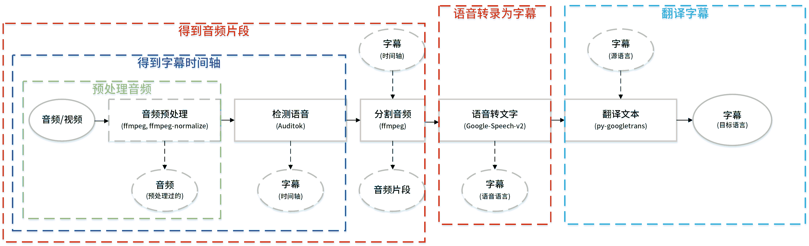

# Autosub

<escape><a href="https://travis-ci.org/BingLingGroup/autosub"></img></a> <a href="https://app.fossa.io/projects/git%2Bgithub.com%2FBingLingGroup%2Fautosub"></img></a></escape>

[English](../README.md)

本仓库不同于[原仓库](https://github.com/agermanidis/autosub)。

本仓库由多人修改过，请查看[更新日志](CHANGELOG.zh-Hans.md)。

<escape></escape>

[autosub图标](docs/icon/autosub.svg)由冰灵制作。

软件: [inkscape](https://inkscape.org/zh/)

字体: [思源黑体](https://github.com/adobe-fonts/source-han-sans) ([SIL](https://github.com/adobe-fonts/source-han-sans/blob/master/LICENSE.txt))

颜色: [Solarized](https://en.wikipedia.org/wiki/Solarized_(color_scheme)#Colors)

### 目录

1. [介绍](#介绍)
2. [证书](#证书)
3. [依赖](#依赖)
   - 3.1 [可选依赖](#可选依赖)
   - 3.2 [必需依赖](#必需依赖)
4. [下载与安装](#下载与安装)
   - 4.1 [分支](#分支)
   - 4.2 [在Ubuntu上安装](#在Ubuntu上安装)
   - 4.3 [在Windows上安装](#在Windows上安装)
5. [工作流程](#工作流程)
   - 5.1 [输入](#输入)
   - 5.2 [分割](#分割)
   - 5.3 [语音转文字/翻译API请求](#语音转文字翻译api请求)
   - 5.4 [语音转文字/翻译语言支持](#语音转文字翻译语言支持)
   - 5.5 [输出](#输出)
6. [使用方法](#使用方法)
   - 6.1 [典型用法](#典型用法)
     - 6.1.1 [音频预处理](#音频预处理)
     - 6.1.2 [检测语音区域](#检测语音区域)
     - 6.1.3 [分割音频](#分割音频)
     - 6.1.4 [语音转录为字幕](#语音转录为字幕)
       - 6.1.4.1 [Google Speech V2](#google-speech-v2)
       - 6.1.4.2 [Google Cloud Speech-to-Text](#google-cloud-speech-to-text)
       - 6.1.4.3 [Google语音识别配置](#Google语音识别配置)
       - 6.1.4.4 [输出API完整响应](#输出API完整响应)
       - 6.1.4.5 [讯飞云语音识别配置](#讯飞云语音识别配置)
       - 6.1.4.6 [百度语音识别配置](#百度语音识别配置)
     - 6.1.5 [翻译字幕](#翻译字幕)
   - 6.2 [选项](#选项)
   - 6.3 [国际化](#国际化)
7. [常见问题](#常见问题)
   - 7.1 [其他API的支持](#其他API的支持)
   - 7.2 [批量处理](#批量处理)
   - 7.3 [代理支持](#代理支持)
   - 7.4 [macOS locale问题](#macos-locale问题)
   - 7.5 [准确性](#准确性)
8. [问题反馈](#问题反馈)
9. [构建](#构建)

点击上箭头以返回目录。

### 介绍

Autosub是一个字幕自动生成工具。它能使用Auditok来自动检测语音区域，通过ffmpeg根据语音区域来切割音频，通过多个API将语音转为文字，以及通过py-googletrans将字幕文本翻译。

上方提到的一些新功能仅在最新的alpha分支中提供。PyPI或者原仓库中的代码并没有这些功能。

### 证书

这个仓库和[原仓库](https://github.com/agermanidis/autosub)的证书不一样。

[GPLv3](../LICENSE)

[](https://app.fossa.io/projects/git%2Bgithub.com%2FBingLingGroup%2Fautosub)

### 依赖

Autosub依赖于这些第三方的软件或者Python的site-packages。非常感谢以下这些项目的工作。

#### 可选依赖

- [ffmpeg](https://ffmpeg.org/)
- [ffprobe](https://ffmpeg.org/ffprobe.html)
- [ffmpeg-normalize](https://github.com/slhck/ffmpeg-normalize)
- [langcodes](https://github.com/LuminosoInsight/langcodes)
- [python-Levenshtein](https://github.com/ztane/python-Levenshtein)([fuzzywuzzy](https://github.com/seatgeek/fuzzywuzzy)的可选依赖)

对于windows用户：

- [Visual Studio 2019 生成工具](https://visualstudio.microsoft.com/downloads/)
  - [marisa-trie](https://github.com/pytries/marisa-trie)安装时会用到。
  - [marisa-trie](https://github.com/pytries/marisa-trie)是[langcodes](https://github.com/LuminosoInsight/langcodes))的依赖。
  - 大概需要安装以下两个组件：MSVC v14 VS 2019 C++生成工具, windows 10 SDK。

#### 必需依赖

- [auditok 0.1.5](https://github.com/amsehili/auditok)
- [pysubs2](https://github.com/tkarabela/pysubs2)
- [wcwidth](https://github.com/jquast/wcwidth)
- [requests](https://github.com/psf/requests)
- [fuzzywuzzy](https://github.com/seatgeek/fuzzywuzzy)
- [progressbar2](https://github.com/WoLpH/python-progressbar)
- [websocket-client](https://github.com/websocket-client/websocket-client)
- [py-googletrans](https://github.com/ssut/py-googletrans)

[requirements.txt](requirements.txt)。

如何安装这些依赖，参见[下载和安装](#下载和安装)。

<escape><a href = "#目录">&nbsp;↑&nbsp;</a></escape>

### 下载与安装

除去PyPI版本的代码和原仓库的一致，其他的安装方式均包含非原仓库的代码。

0.4.0 > autosub

- 这些版本只与Python 2.7兼容。

0.5.6a >= autosub >= 0.4.0

- 这些版本与Python3和Python2.7兼容。所以后面的安装指令中的Python版本你可以随便改。

autosub >= 0.5.7a

- 这些版本只与Python 3兼容。

ffmpeg, ffprobe, ffmpeg-normalize需要被放在以下位置之一来让autosub检测并使用。以下代码都在[constants.py](autosub/constants.py)里。优先级按照先后顺序确定。

1. 在运行程序前设置以下环境变量：`FFMPEG_PATH`，`FFPROBE_PATH`和 `FFMPEG_NORMALIZE_PATH`。它会替代环境变量`PATH`里的值。如果你不想使用`PATH`里的值，那么这会帮到你。
2. 把它们加入环境变量`PATH`。如果使用的是包管理器进行的安装，那么就不需要关心这件事。用包管理器进行安装是指使用pip安装ffmpeg-normalize或者chocolatey安装ffmpeg。
3. 把它们放在和autosub的可执行文件的同一个目录下。
4. 把它们放在当前命令行工作的文件夹下。

至于git的安装，如果你不想通过pip的[VCS](https://pip.pypa.io/en/stable/reference/pip_install/#vcs-support)支持来安装python包或者只是不想碰git的环境变量这些东西，你可以手动点击clone and download来下载源码并在[本地](https://pip.pypa.io/en/stable/reference/pip_install/#description)进行安装。指令如下。

```batch
cd 有源码的目录
pip install .
```

因为autosub的PyPI版本是被原repo的拥有者所维护的，我无法修改它，也无法上传一个有着相同名字的项目。也许等到这个项目变得更加稳定的时候，我会重命名并复制这个仓库，然后再把它传到PyPI去。

#### 分支

[alpha分支](https://github.com/BingLingGroup/autosub/tree/alpha)

- 包括大量在[原仓库代码](https://github.com/agermanidis/autosub)基础上的改动。详见[更新日志](CHANGELOG.zh-Hans.md)。代码仅在发布alpha版本时更新，相对来讲会比dev分支稳定。

[origin分支](https://github.com/BingLingGroup/autosub/tree/origin)

- 不包含[alpha分支](https://github.com/BingLingGroup/autosub/tree/alpha)中添加的新功能，仅包含最少的改动来让程序能在Windows上正常运行，可以看作只是[原仓库](https://github.com/agermanidis/autosub)的版本的修复版，而不会遇到各种各样的问题。现在不再维护。

[dev分支](https://github.com/BingLingGroup/autosub/tree/dev)

- 开发中代码所在分支，如果没有问题，代码会在发布新版本时合并到alpha分支。
- 只被用来测试或者提出拉取请求。除非你知道自己在干什么，否则不要安装它们。

<escape><a href = "#目录">&nbsp;↑&nbsp;</a></escape>

#### 在Ubuntu上安装

包含依赖的安装。

从`alpha`分支安装。（最新alpha发布版）

```bash
apt install ffmpeg python python-pip git -y
pip install git+https://github.com/BingLingGroup/autosub.git@alpha ffmpeg-normalize langcodes
```

从`dev`分支安装。（最新dev版）

```bash
apt install ffmpeg python python-pip git -y
pip install git+https://github.com/BingLingGroup/autosub.git@dev ffmpeg-normalize langcodes
```

从`origin`分支安装。（autosub-0.4.0a）

```bash
apt install ffmpeg python python-pip git -y
pip install git+https://github.com/BingLingGroup/autosub.git@origin
```

从PyPI安装。（autosub-0.3.12）

```bash
apt install ffmpeg python python-pip -y
pip install autosub
```

推荐使用`python3`和`python-pip3`而不是`python`和`python-pip`在autosub-0.4.0之后。

<escape><a href = "#目录">&nbsp;↑&nbsp;</a></escape>

#### 在Windows上安装

你可以直接去[发布页](https://github.com/BingLingGroup/autosub/releases)下载Windows的最新发布版。包内自带懒人批处理。你可以使用Notepad++对其进行手动修改。或者把含有exe的目录放到系统环境变量里，这样你就可以在别的目录也使用autosub了，前提是那个目录没有权限限制。

建议：`Shift - 右键`是打开当前目录Powershell的快捷键。Powershell打开当前目录的exe需要输入这样的格式`.\autosub`。

或者你也可以直接打开它并手动输入参数，尽管我并不建议这样做，因为效率比较低。

- 发布包里没有pyinstaller后缀的是Nuitka编译的。它比pyinstaller的版本快，因为它是编译的，不同于pyinstaller只是把程序进行了打包。
- ffmpeg和ffmpeg-normalize也在发布包内。原本ffmpeg-normalize没有独立运行的版本。这个独立运行的ffmpeg-normalize是另外构建的。代码在[这里](https://github.com/BingLingGroup/ffmpeg-normalize)。
- 如果在使用发布包时遇到任何问题，或者包的大小太大或者遇到了什么烦人的事情，你依然可以采用下方所说的通过pip的方法进行安装。

或者通过choco来安装Python环境（如果你还没有），然后安装这个包。

推荐在windows上使用[chocolatey](https://chocolatey.org)来安装环境和依赖。

命令行安装choco的指令如下。（不是Powershell）

```batch
@"%SystemRoot%\System32\WindowsPowerShell\v1.0\powershell.exe" -NoProfile -InputFormat None -ExecutionPolicy Bypass -Command "iex ((New-Object System.Net.WebClient).DownloadString('https://chocolatey.org/install.ps1'))" && SET "PATH=%PATH%;%ALLUSERSPROFILE%\chocolatey\bin"
```

从`alpha`分支安装。（最新alpha发布版）

```batch
choco install git python curl ffmpeg -y
curl https://bootstrap.pypa.io/get-pip.py -o get-pip.py
python get-pip.py
pip install git+https://github.com/BingLingGroup/autosub.git@alpha ffmpeg-normalize
```

从`dev`分支安装。（最新dev版）

```batch
choco install git python curl ffmpeg -y
curl https://bootstrap.pypa.io/get-pip.py -o get-pip.py
python get-pip.py
pip install git+https://github.com/BingLingGroup/autosub.git@dev ffmpeg-normalize langcodes
```

从`origin`分支安装。（autosub-0.4.0a）

```batch
choco install git python2 curl ffmpeg -y
curl https://bootstrap.pypa.io/get-pip.py -o get-pip.py
python get-pip.py
pip install git+https://github.com/BingLingGroup/autosub.git@origin
```

PyPI的版本（autosub-0.3.12）不推荐在windows上使用，因为它无法成功运行。查看[origin分支的更新日志](CHANGELOG.zh-Hans.md#040-alpha---2019-02-17)来了解详情。

在autosub-0.4.0之后，推荐使用`python`而不是`python2`。

<escape><a href = "#目录">&nbsp;↑&nbsp;</a></escape>

### 工作流程

#### 输入

一个视频/音频/字幕文件。

如果是一个视频或者音频文件，使用ffmpeg来将格式转换为[API支持的格式](https://github.com/gillesdemey/google-speech-v2#data)。任何ffmpeg支持输入的格式皆可，但是输出或者处理后给API的格式是受API和autosub代码的限制的。

当前支持的格式：

[Google-Speech-v2](https://github.com/gillesdemey/google-speech-v2)

- 24bit/44100Hz/单声道 FLAC（默认参数）
- 其他格式像OGG_OPUS是API不支持的。（我尝试过修改请求头或者修改为json请求都不行）或者像PCM这种有着比FLAC单位采样更少位宽但更大存储消耗的格式。虽然API支持，但我觉得没必要支持就没改代码去支持。

[Google Cloud Speech-to-Text API](https://cloud.google.com/speech-to-text/docs/encoding) [v1p1beta1](https://cloud.google.com/speech-to-text/docs/reference/rest/v1p1beta1/RecognitionConfig#AudioEncoding)

- 支持
  - 24bit/44100Hz/单声道 FLAC（默认参数）
- 支持但不是默认参数 （详见[语音转文字/翻译API请求](#语音转文字翻译api请求)）
  - 8000Hz|12000Hz|16000Hz|24000Hz|48000Hz/单声道 OGG_OPUS
  - MP3
  - 16bit/单声道 PCM

[讯飞语音听写（流式版）WebSocket API](https://www.xfyun.cn/doc/asr/voicedictation/API.html#%E6%8E%A5%E5%8F%A3%E8%A6%81%E6%B1%82)/[百度短语音识别/短语音识别极速版API](https://ai.baidu.com/ai-doc/SPEECH/Vk38lxily)

- 支持
  - 16bit/16000Hz/单声道 PCM

你也可以使用自带的音频预处理功能，尽管谷歌并不[如此推荐](https://cloud.google.com/speech-to-text/docs/best-practices)。实话讲，如果你音频的音量没有被标准化，譬如音量太大或者太小，建议你使用一些工具或者只是自带的音频预处理功能去将其音量标准化。默认的[音频预处理指令](https://github.com/agermanidis/autosub/issues/40)同时依赖于ffmpeg和ffmpeg-normalize。这些命令包含三个子命令。[第一个](https://trac.ffmpeg.org/wiki/AudioChannelManipulation)是用来把双声道的音频转换为单声道的。[第二个](https://superuser.com/questions/733061/reduce-background-noise-and-optimize-the-speech-from-an-audio-clip-using-ffmpeg)是通过人声的频率范围来过滤噪音的。第三个则是正常化音频的音量来确保它的音量不是太大或者太小。如果你对默认指令的效果不满意，你也可以通过输入`-apc`选项来自行修改。当然，它仍然只支持24bit/44100Hz/单声道 FLAC格式。

如果输入是字幕文件，同时你提供的参数适合，程序仅会将其通过py-googletrans来翻译。

#### 分割

音频长度限制:

[Google-Speech-v2](https://github.com/gillesdemey/google-speech-v2)

- 不超过[10到15秒](https://github.com/gillesdemey/google-speech-v2#caveats)。
- 在autosub里面，按照[60秒](https://github.com/BingLingGroup/autosub/blob/dev/autosub/constants.py#L74)来限制。

[Google Cloud Speech-to-Text API](https://cloud.google.com/speech-to-text/docs/encoding)

- 不超过[1分钟](https://cloud.google.com/speech-to-text/docs/sync-recognize)。
- 在autosub里面，同样按照[60秒](https://github.com/BingLingGroup/autosub/blob/dev/autosub/constants.py#L74)来限制。
- 现在只支持同步语言识别意味着只支持短语音识别。

[讯飞语音听写（流式版）WebSocket API](https://www.xfyun.cn/doc/asr/voicedictation/API.html#%E6%8E%A5%E5%8F%A3%E8%A6%81%E6%B1%82)/[百度短语音识别/短语音识别极速版API](https://ai.baidu.com/ai-doc/SPEECH/Vk38lxily)

- 限制同上。

Autosub使用Auditok来检测语音区域。通过语音区域来分割并转换视频/音频为许多短语音片段。每个区域对应一个片段一个API请求。所有这些片段都是直接从输入转换的，避免任何多余的损失。

或者使用外部文件提供的时间码来作为语音区域输入，支持pysubs2支持的文件格式，如`.ass`或者`.srt`。这样你就可以使用外部工具先制作时间轴然后让程序使用并得到精确度更高的识别结果。

#### 语音转文字/翻译API请求

使用Python的多进程库对API请求进行并行化处理，来加速转录速度。一个语音片段一次请求。识别速度主要取决于你网络的上传速度。

- 可能需要对字幕文件行进行手动后处理，某些行可能长度过长，导致无法被放在视频画面长度中的同一行。

在语音转文字之后，把字幕翻译成别的语言。将多行文本融合为一块长文本然后送去请求。详见[issue #49](https://github.com/BingLingGroup/autosub/issues/49)。最后再把结果保存在本地。

<escape><a href = "#目录">&nbsp;↑&nbsp;</a></escape>

#### 语音转文字/翻译语言支持

以下是Google API的预言代码说明，关于其他API的使用方法，详见：[讯飞云语音识别配置](#讯飞云语音识别配置)，[百度语音识别配置](#百度语音识别配置)。

语音转文字的语言代码和翻译的语言代码是不一样的，因为这俩API并不相同。当然啦，这些语言代码的格式是*谷歌化*的，和iso标准不一样，会导致用户使用时很迷惑。

为了解决这个问题，autosub使用[langcodes](https://github.com/LuminosoInsight/langcodes)来检测输入的语言代码并在语言代码清单中找到与其最匹配的一项来使用。默认并不会启用这个功能。需要在不同的阶段都启动这个功能，可以使用选项`-bm all`。

为了手动匹配或者查看本程序允许使用的语言代码，你可以通过输入参数`-lsc`/`--list-speech-to-text-codes`以及`-ltc`/`--list-translation-codes`来获得。或者你也可以打开[constants.py](../autosub/constants.py)来查看。

为了得到某个字幕文件第一行的语言，你可以使用`-dsl`选项去检测。

- 现在，autosub会允许发送不在`--list-speech-codes`清单中的语言代码，意味着在这种情况下程序不会终止运行。

- 尽管你可以输入任何你想输入的语言代码，需要指出的是如果你使用了不在清单上的语言代码但是API接受了，[Google-Speech-v2](https://github.com/gillesdemey/google-speech-v2)可能会按照你的IP地址机型个性化识别，而这是不受你控制的。这是一个已知的问题，我已经在原仓库申请了[拉取请求](https://github.com/agermanidis/autosub/pull/136)。

- 另外一方面，[py-googletrans](https://github.com/ssut/py-googletrans)更加严格。当它收到了一个不在它清单内的语言代码，它会直接抛出异常。

- 除了用户输入的部分，另外一个显著的更改是我将`-S`选项分为了两部分，一个是`-S`一个是`-SRC`。`-S`选项是给语音识别的语言代码使用的。`-SRC`则是给翻译源语言代码使用的。如果不输入`-SRC`的参数时，autosub会使用[langcodes](https://github.com/LuminosoInsight/langcodes)来匹配`-S`的参数来获得其在翻译支持的语言代码清单中的最佳匹配，尽管[py-googletrans](https://github.com/ssut/py-googletrans)可以自动检测翻译源语言。当然你可以手动配置`-SRC`选项。而`-D`还是给目标翻译语言使用的，和之前一样。

<escape><a href = "#目录">&nbsp;↑&nbsp;</a></escape>

#### 输出

目前支持以下这些输出格式。

```Python
OUTPUT_FORMAT = {
    'srt': 'SubRip',
    'ass': 'Advanced SubStation Alpha',
    'ssa': 'SubStation Alpha',
    'sub': 'MicroDVD Subtitle',
    'mpl2.txt': 'Similar to MicroDVD',
    'tmp': 'TMP Player Subtitle Format',
    'vtt': 'WebVTT',
    'json': 'json(Only times and text)',
    'ass.json': 'json(Complex ass content json)',
    'txt': 'Plain Text(Text or times)'
}
```

或者其他的字幕种类/输出模式，取决于你的需要。帮助中有更多的相关信息。

```Python
DEFAULT_MODE_SET = {
    'regions',
    'src',
    'full-src',
    'dst',
    'bilingual',
    'dst-lf-src',
    'src-lf-dst'
}
```

<escape><a href = "#目录">&nbsp;↑&nbsp;</a></escape>

### 使用方法

对于原版autosub的使用，可以参见这篇[简体中文使用指南](https://binglinggroup.github.io/archives/autosub安装使用指南(windows及ubuntu).html)。

对于alpha分支autosub的使用，可以参考以下典型用法。

#### 典型用法

<escape><div title="Typical usage" align="middle"></div></escape>

##### 音频预处理

使用默认的[音频预处理](https://github.com/agermanidis/autosub/issues/40)。

仅音频预处理。

```
autosub -i 输入文件 -ap o
```

音频预处理只是处理过程中的一部分。

```
autosub -i 输入文件 -ap y ...(其他选项)
```

##### 检测语音区域

使用Auditok检测语音区域。

仅得到时间轴。

```
autosub -i 输入文件
```

得到时间轴只是处理过程中的一部分。

```
autosub -i 输入文件 -of regions ...(其他选项)
```

<escape><a href = "#目录">&nbsp;↑&nbsp;</a></escape>

##### 分割音频

根据语音区域得到音频片段。

根据自动语音区域检测，只获取音频片段。

```
autosub -i 输入文件 -ap s
```

根据外部语音区域输入，只获取音频片段。

```
autosub -i 输入文件 -ap s -er 时间轴字幕
```

获取音频片段只是处理过程中的一部分。

```
autosub -i 输入文件 -k ...(其他选项)
```

##### 语音转录为字幕

语音音频片段转为语音语言字幕。

###### Google Speech V2

使用默认的[Google-Speech-v2](https://github.com/gillesdemey/google-speech-v2)仅转录得到语音语言字幕。

```
autosub -i 输入文件 -S 语言代码
```

使用默认的[Google-Speech-v2](https://github.com/gillesdemey/google-speech-v2)得到语音语言字幕只是处理过程中的一部分。

```
autosub -i 输入文件 -S 语言代码 -of src ...(其他选项)
```

<escape><a href = "#目录">&nbsp;↑&nbsp;</a></escape>

###### Google Cloud Speech-to-Text

使用Google Cloud Speech-to-Text API服务账号（GOOGLE_APPLICATION_CREDENTIALS环境变量已经设置好了）来转录字幕。

```
autosub -i 输入文件 -sapi gcsv1 -S 语言代码 ...(其他选项)
```

使用Google Cloud Speech-to-Text API服务账号（GOOGLE_APPLICATION_CREDENTIALS环境变量由选项`-sa`设置）来转录字幕。

```
autosub -i 输入文件 -sapi gcsv1 -S 语言代码 -sa 服务账号凭据文件路径 ...(其他选项)
```

使用Google Cloud Speech-to-Text API密钥来转录字幕。

```
autosub -i 输入文件 -sapi gcsv1 -S 语言代码 -skey API密钥 ...(其他选项)
```

在Google Cloud Speech-to-Text API中使用48000Hz OGG_OPUS格式。转换指令在[此代码]((https://github.com/BingLingGroup/autosub/blob/alpha/autosub/__init__.py#L135-L140))中会被自动被替换。

```
autosub -i 输入文件 -sapi gcsv1 -asf .ogg -asr 48000 ...(其他选项)
```

在Google Cloud Speech-to-Text API中使用MP3格式。(不推荐这样用，因为OGG_OPUS比MP3更好)
```
autosub -i 输入文件 -sapi gcsv1 -asf .mp3 ...(其他选项)
```

<escape><a href = "#目录">&nbsp;↑&nbsp;</a></escape>

###### Google语音识别配置

使用定制的[语音识别配置文件](https://googleapis.dev/python/speech/latest/gapic/v1/types.html#google.cloud.speech_v1.types.RecognitionConfig)来发送请求给Google Cloud Speech API。如果使用配置文件，就会替代这些选项：`-S`, `-asr`, `-asf`。

如果使用了选项`-bm src`或者`-bm all`，那么`language_code`会被最佳匹配替代。如果使用了服务账号凭据，那么`encoding`会被`google.cloud.speech_v1p1beta1.enums.RecognitionConfig.AudioEncoding`里的枚举 替代。默认`encoding`是`FLAC`。默认`sample_rate_hertz`是`44100`。

示例语音识别配置文件：

```json
{
    "language_code": "zh",
    "enable_word_time_offsets": true
}
```

如果不提供选项`-asr`和`-asf`，等效于：

```json
{
    "language_code": "zh",
    "sample_rate_hertz": 44100,
    "encoding": "FLAC",
    "enable_word_time_offsets": true
}
```

否则：

```json
{
    "language_code": "zh",
    "sample_rate_hertz": "由--api-sample-rate提供",
    "encoding": "由--api-suffix提供",
    "enable_word_time_offsets": true
}
```

命令：

```
autosub -i 输入文件 -sconf json格式配置文件 -bm all -sapi gcsv1 -skey API密钥 ...(其他选项)
```

<escape><a href = "#目录">&nbsp;↑&nbsp;</a></escape>

###### 输出API完整响应

现在autosub不能处理API返回的语音识别结果里的很多[高级属性](https://cloud.google.com/speech-to-text/docs/reference/rpc/google.cloud.speech.v1p1beta1#google.cloud.speech.v1p1beta1.SpeechRecognitionResult)，特别是从Google Cloud Speech-to-Text API中返回的。配合复杂的[语音识别配置](#speech-config)输入和选项`-of full-src`，语音识别结果就会被输出到json格式的文件中，所以你能定制化并在autosub外部处理这些数据。

示例json格式输出：

```json
[
    {
        "start": 0.52,
        "end": 1.31,
        "content": {
            "results": [
                {
                    "alternatives": [
                        {
                            "confidence": 0.98267895,
                            "transcript": "how old is the Brooklyn Bridge"
                        }
                    ]
                }
            ]
        }
    }
]
```

"start"和"end"的意思是对整个音频文件而言的开始和结束秒。"content"则是从API接收到的结果

命令：

```
autosub -i 输入文件 -sconf json格式配置文件 -bm all -sapi gcsv1 -skey API密钥 -of full-src ...(其他选项)
```

<escape><a href = "#目录">&nbsp;↑&nbsp;</a></escape>

##### 讯飞云语音识别配置

对于讯飞开放平台语音听写（流式版）WebAPI的使用，用户必须输入它的语音识别配置文件。

示例语音识别配置文件：

```json
{
    "app_id": "",
    "api_secret": "",
    "api_key": "",
    "business": {
        "language": "zh_cn",
        "domain": "iat",
        "accent": "mandarin"
    }
}
```

`"business"`属性和[讯飞文档](https://www.xfyun.cn/doc/asr/voicedictation/API.html#%E4%B8%9A%E5%8A%A1%E5%8F%82%E6%95%B0)里所说的一样。

当文件中不包含`"business"`属性时，autosub会使用如上的默认内容。

如果在配置文件中添加`"delete_chars": "，。"`（逗号和句号是需要删除的标点符号），autosub会在接收到识别结果时自动将指定符号替换为空格，并消除每句末尾空格。

命令:

```
autosub -sapi xfyun -i 输入文件 -sconf 讯飞云语音配置文件 ...(其他选项)
```

<escape><a href = "#目录">&nbsp;↑&nbsp;</a></escape>

##### 百度语音识别配置

对于百度短语音识别/短语音识别极速版的使用，用户必须输入它的语音识别配置文件。

示例语音识别配置文件：

```json
{
    "AppID": "",
    "API key": "",
    "Secret Key": "",
    "config": {
        "format": "pcm",
        "rate": 16000,
        "channel": 1,
        "cuid": "python",
        "dev_pid": 1537
    }
}
```

`"config"`属性和[百度短语音识别文档](https://ai.baidu.com/ai-doc/SPEECH/ek38lxj1u)里所说的一样。

如果你要使用短语音识别极速版，把`"cuid"`改为`80001`即可。

如果文件中不包含`"config"`属性，autosub会使用如上的默认内容。

同样可以使用上文所说的`"delete_chars"`功能。

实测由于百度短语音识别/短语音识别极速版默认不允许并发，所以并发会被限制为1，如果需要解除限制，请在配置文件中添加`"disable_qps_limit": true,`，解除后并发即为选项`-sc`所设置的。

命令：

```
autosub -sapi baidu -i 输入文件 -sconf 百度语音配置文件 ...(其他选项)
```

<escape><a href = "#目录">&nbsp;↑&nbsp;</a></escape>

##### 翻译字幕

将字幕翻译为别的语言。

如果不输入选项`-SRC`，翻译源语言会被py-googletrans自动检测。

从音频/视频文件翻译字幕。

```
autosub -i 输入文件 -S 语言代码 (-SRC 语言代码) -D 语言代码
```

从字幕文件翻译字幕。

```
autosub -i 输入文件 (-SRC 语言代码) -D 语言代码
```

使用"translate.google.cn"翻译字幕，"translate.google.cn"可被某地直连。

```
autosub -i 输入文件 -surl "translate.google.cn" ...(其他选项)
```

<escape><a href = "#目录">&nbsp;↑&nbsp;</a></escape>

#### 选项

帮助信息的完整列表。

```
$ autosub -h
usage:
用法：autosub [-i 路径] [选项]

为视频/音频/字幕文件自动生成字幕。

输入选项:
  控制输入的选项。

  -i 路径, --input 路径     用于生成字幕文件的视频/音频/字幕文件。如果输入文件是字幕文件，程序仅会对其进行翻译。（参数个数为1）
  -er 路径, --ext-regions 路径
                        提供外部语音区域（时间轴）的字幕文件。该字幕文件格式需要是pysubs2所支持的。使用后会替换掉默认的自动寻
                        找语音区域（时间轴）的功能。（参数个数为1）
  -sty [路径], --styles [路径]
                        当输出格式为"ass"/"ssa"时有效。为你的字幕文件提供"ass"/"ssa"样式的字幕文件。如果不提供
                        参数，它会使用来自"-esr"/"--external-speech-
                        regions"选项提供的样式。更多信息详见"-sn"/"--styles-name"。（参数个数为0或1）
  -sn [样式名 [样式名 ...]], --styles-name [样式名 [样式名 ...]]
                        当输出格式为"ass"/"ssa"且"-sty"/"--styles"选项提供参数时有效。给输出字幕文件行提
                        供"ass"/"ssa"字幕的样式名。如果不提供该选项，字幕行会使用文件中的第一个样式名。如果参数个数为1，
                        字幕行会使用来自"-sty"/"--styles"的参数作为样式名。如果参数个数为2，源语言字幕行会使用第一
                        个参数作为样式名。目标语言行使用第二个。（参数个数为1或2）

语言选项:
  控制语言的选项。

  -S 语言代码, --speech-language 语言代码
                        用于语音识别的语言代码/语言标识符。推荐使用Google Cloud Speech的参考语言代码。错误的输入
                        不会终止程序。但是后果自负。参考：https://cloud.google.com/speech-to-
                        text/docs/languages（参数个数为1）（默认参数： None）
  -SRC 语言代码, --src-language 语言代码
                        用于翻译的目标语言的语言代码/语言标识符。如果没有提供，使用py-
                        googletrans来自动检测源语言。（参数个数为1）（默认参数为auto）
  -D 语言代码, --dst-language 语言代码
                        用于翻译的目标语言的语言代码/语言标识符。（参数个数为1）（默认参数为None）
  -bm [模式 [模式 ...]], --best-match [模式 [模式 ...]]
                        使用langcodes为输入获取一个最佳匹配的语言代码。仅在使用py-googletrans和Google
                        Speech V2时起作用。如果langcodes未安装，使用fuzzywuzzy来替代。可选的模式：s,
                        src, d, all。"s"指"-S"/"--speech-
                        language"。"src"指"-SRC"/"--src-language"。"d"指"-D"/"--
                        dst-language"。（参数个数在1到3之间）
  -mns integer, --min-score integer
                        一个介于0和100之间的整数用于控制以下两个选项的匹配结果组，"-lsc"/"--list-speech-
                        codes"以及"-ltc"/"--list-translation-codes"或者在"-bm"/"--
                        best-
                        match"选项中的最佳匹配结果。结果会是一组“好的匹配”，其分数需要超过这个参数的值。（参数个数为1）

输出选项:
  控制输出的选项。

  -o 路径, --output 路径    输出字幕文件的路径。（默认值是"input"路径和适当的文件名后缀的结合）（参数个数为1）
  -F 格式, --format 格式    输出字幕的格式。如果没有提供该选项，使用"-o"/"--output"参数中的后缀。如果"-o"/"--
                        output"参数也没有提供扩展名，那么使用"srt"。在这种情况下，如果"-i"/"--
                        input"的参数是一个字幕文件，那么使用和字幕文件相同的扩展名。（参数个数为1）（默认参数为srt）
  -y, --yes             避免任何暂停和覆写文件的行为。如果参数有误，会直接停止程序。（参数个数为0）
  -of [种类 [种类 ...]], --output-files [种类 [种类 ...]]
                        输出更多的文件。可选种类：regions，src，full-src，dst，bilingual，dst-
                        lf-src，src-lf-
                        dst，all。（时间轴，源语言字幕，完整语音识别结果，目标语言字幕，双语字幕，dst-lf-
                        src,，src-lf-dst，所有）full-
                        src：由语音转文字API得到的json格式的完整语音识别结果加上开始和结束时间。dst-lf-
                        src：目标语言和源语言在同一字幕行中，且目标语言先于源语言。src-lf-dst：源语言和目标语言在同一字
                        幕行中，且源语言先于目标语言。（参数个数在6和1之间）（默认参数为['dst']）
  -fps float, --sub-fps float
                        当输出格式为"sub"时有效。如果提供了该参数，它会取代原有的对输入文件的帧率检查。参考：https://p
                        ysubs2.readthedocs.io/en/latest/api-
                        reference.html#supported-input-output-formats（参数个数为1）

语音选项:
  控制语音转文字的选项。

  -sapi API代码, --speech-api API代码
                        选择使用Speech-to-Text API。当前支持：gsv2：Google Speech V2
                        （https://github.com/gillesdemey/google-speech-v2）。
                        gcsv1：Google Cloud Speech-to-Text V1P1Beta1
                        （https://cloud.google.com/speech-to-
                        text/docs）。xfyun：讯飞开放平台语音听写（流式版）WebSocket API（https://
                        www.xfyun.cn/doc/asr/voicedictation/API.html）。baidu:
                        百度短语音识别/短语音识别极速版（https://ai.baidu.com/ai-
                        doc/SPEECH/Vk38lxily）（参数个数为1）（默认参数为gsv2）
  -skey key, --speech-key key
                        Google Speech-to-Text API的密钥。（参数个数为1）当前支持：gsv2：gsv2的AP
                        I密钥。（默认参数为免费API密钥）gcsv1：gcsv1的API密钥。（如果使用了，可以覆盖
                        "-sa"/"--service-account"提供的服务账号凭据）
  -sconf [路径], --speech-config [路径]
                        使用语音转文字识别配置文件来发送请求。取代以下选项："-S", "-asr",
                        "-asf"。目前支持：gcsv1：Google Cloud Speech-to-Text
                        V1P1Beta1 API密钥配置参考：https://cloud.google.com/speech-
                        to-
                        text/docs/reference/rest/v1p1beta1/RecognitionConfig 服
                        务账号配置参考：https://googleapis.dev/python/speech/latest/ga
                        pic/v1/types.html#google.cloud.speech_v1.types.Recogni
                        tionConfig 。xfyun：讯飞开放平台语音听写（流式版）WebSocket
                        API（https://console.xfyun.cn/services/iat）。baidu:
                        百度短语音识别/短语音识别极速版（https://ai.baidu.com/ai-doc/SPEECH/ek
                        38lxj1u）。如果参数个数是0，使用const路径。（参数个数为0或1）（const为config.js
                        on）
  -mnc float, --min-confidence float
                        Google Speech-to-Text API用于识别可信度的回应参数。一个介于0和1之间的浮点数。可信
                        度越高意味着结果越好。输入这个参数会导致所有低于这个结果的识别结果被删除。参考：https://github
                        .com/BingLingGroup/google-
                        speech-v2#response（参数个数为1）（默认参数为0.0）
  -der, --drop-empty-regions
                        删除所有没有语音识别结果的空轴。（参数个数为0）
  -sc integer, --speech-concurrency integer
                        用于Speech-to-Text请求的并行数量。（参数个数为1）（默认参数为4）

py-googletrans选项:
  控制翻译的选项。同时也是默认的翻译方法。可能随时会被谷歌爸爸封。

  -slp 秒, --sleep-seconds 秒
                        （实验性）在两次翻译请求之间睡眠（暂停）的时间。（参数个数为1）（默认参数为1）
  -surl [URL [URL ...]], --service-urls [URL [URL ...]]
                        （实验性）自定义多个请求URL。参考：https://py-
                        googletrans.readthedocs.io/en/latest/（参数个数大于等于1）
  -ua User-Agent headers, --user-agent User-Agent headers
                        （实验性）自定义用户代理（User-Agent）头部。同样的参考文档如上。（参数个数为1）
  -doc, --drop-override-codes
                        在翻译前删除所有文本中的ass特效标签。只影响翻译结果。（参数个数为0）
  -gt-dc [chars], --gt-delete-chars [chars]
                        将指定字符替换为空格，并消除每句末尾空格。只会影响翻译结果。（参数个数为0或1）（const为，。！）

字幕转换选项:
  控制字幕转换的选项。

  -mjs integer, --max-join-size integer
                        (Experimental)Max length to join two events. (arg_num
                        = 1) (default: 100)
  -mdt 秒, --max-delta-time 秒
                        (Experimental)Max delta time to join two events.
                        (arg_num = 1) (default: 0.2)
  -dms string, --delimiters string
                        (Experimental)Delimiters not to join two events.
                        (arg_num = 1) (default: !()*,.:;?[]^_`~)
  -sw1 words_delimited_by_space, --stop-words-1 words_delimited_by_space
                        (Experimental)First set of Stop words to split two
                        events. (arg_num = 1)
  -sw2 words_delimited_by_space, --stop-words-2 words_delimited_by_space
                        (Experimental)Second set of Stop words to split two
                        events. (arg_num = 1)
  -ds, --dont-split     (Experimental)Don't Split just merge. (arg_num = 0)

网络选项:
  控制网络的选项。

  -hsa, --http-speech-api
                        将Google Speech V2 API的URL改为http类型。（参数个数为0）
  -hsp [URL], --https-proxy [URL]
                        通过设置环境变量的方式添加https代理。如果参数个数是0，使用const里的代理URL。（参数个数为0或1
                        ）（const为https://127.0.0.1:1080）
  -hp [URL], --http-proxy [URL]
                        通过设置环境变量的方式添加http代理。如果参数个数是0，使用const里的代理URL。（参数个数为0或1）
                        （const为http://127.0.0.1:1080）
  -pu 用户名, --proxy-username 用户名
                        设置代理用户名。（参数个数为1）
  -pp 密码, --proxy-password 密码
                        设置代理密码。（参数个数为1）

其他选项:
  控制其他东西的选项。

  -h, --help            显示autosub的帮助信息并退出。（参数个数为0）
  -V, --version         显示autosub的版本信息并退出。（参数个数为0）
  -sa 路径, --service-account 路径
                        设置服务账号密钥的环境变量。应该是包含服务帐号凭据的JSON文件的文件路径。如果使用了，会被API密钥选项覆
                        盖。参考：https://cloud.google.com/docs/authentication/gett
                        ing-started
                        当前支持：gcsv1（GOOGLE_APPLICATION_CREDENTIALS）（参数个数为1）

音频处理选项:
  控制音频处理的选项。

  -ap [模式 [模式 ...]], --audio-process [模式 [模式 ...]]
                        控制音频处理的选项。如果没有提供选项，进行正常的格式转换工作。"y"：它会先预处理输入文件，如果成功了，在语
                        音转文字之前不会对音频进行额外的处理。"o"：只会预处理输入音频。（"-k"/"--
                        keep"选项自动置为真）"s"：只会分割输入音频。（"-k"/"--
                        keep"选项自动置为真）以下是用于处理音频的默认命令：C:\Program
                        Files\ImageMagick-7.0.10-Q16\ffmpeg.exe -hide_banner
                        -i "{in_}" -vn -af "asplit[a],aphasemeter=video=0,amet
                        adata=select:key=lavfi.aphasemeter.phase:value=-0.005:
                        function=less,pan=1c|c0=c0,aresample=async=1:first_pts
                        =0,[a]amix" -ac 1 -f flac -loglevel error "{out_}" |
                        C:\Program Files\ImageMagick-7.0.10-Q16\ffmpeg.exe
                        -hide_banner -i "{in_}" -af
                        "lowpass=3000,highpass=200" -loglevel error "{out_}" |
                        C:\Python37\Scripts\ffmpeg-normalize.exe -v "{in_}"
                        -ar 44100 -ofmt flac -c:a flac -pr -p -o "{out_}"（参考：h
                        ttps://github.com/stevenj/autosub/blob/master/scripts/
                        subgen.sh https://ffmpeg.org/ffmpeg-
                        filters.html）（参数个数介于1和2之间）
  -k, --keep            将音频处理中产生的文件放在输出路径中。（参数个数为0）
  -apc [命令 [命令 ...]], --audio-process-cmd [命令 [命令 ...]]
                        这个参数会取代默认的音频预处理命令。每行命令需要放在一个引号内。输入文件名写为{in_}。输出文件名写为{o
                        ut_}。（参数个数大于1）
  -ac integer, --audio-concurrency integer
                        用于ffmpeg音频切割的进程并行数量。（参数个数为1）（默认参数为4）
  -acc 命令, --audio-conversion-cmd 命令
                        （实验性）这个参数会取代默认的音频转换命令。"[", "]" 是可选参数，可以移除。"{",
                        "}"是必选参数，不可移除。（参数个数为1）（默认参数为C:\Program
                        Files\ImageMagick-7.0.10-Q16\ffmpeg.exe -hide_banner
                        -y -i "{in_}" -vn -ac {channel} -ar {sample_rate}
                        -loglevel error "{out_}"）
  -asc 命令, --audio-split-cmd 命令
                        （实验性）这个参数会取代默认的音频转换命令。相同的注意如上。（参数个数为1）（默认参数为C:\Program
                        Files\ImageMagick-7.0.10-Q16\ffmpeg.exe -y -ss {start}
                        -i "{in_}" -t {dura} -vn -ac [channel] -ar
                        [sample_rate] -loglevel error "{out_}"）
  -asf 文件名后缀, --api-suffix 文件名后缀
                        （实验性）这个参数会取代默认的给API使用的音频文件后缀。（默认参数为.flac）
  -asr 采样率, --api-sample-rate 采样率
                        （实验性）这个参数会取代默认的给API使用的音频采样率（赫兹）。（参数个数为1）（默认参数为44100）
  -aac 声道数, --api-audio-channel 声道数
                        （实验性）这个参数会取代默认的给API使用的音频声道数量。（参数个数为1）（默认参数为1）

Auditok的选项:
  不使用外部语音区域控制时，用于控制Auditok的选项。

  -et 能量（相对值）, --energy-threshold 能量（相对值）
                        用于检测是否是语音区域的能量水平。参考：https://auditok.readthedocs.io/en/
                        latest/apitutorial.html#examples-using-real-audio-
                        data（参数个数为1）（默认参数为45）
  -mnrs 秒, --min-region-size 秒
                        最小语音区域大小。同样的参考文档如上。（参数个数为1）（默认参数为0.5）
  -mxrs 秒, --max-region-size 秒
                        最大音频区域大小。同样的参考文档如上。（参数个数为1）（默认参数为10.0）
  -mxcs 秒, --max-continuous-silence 秒
                        在一段有效的音频活动区域中可以容忍的最大（连续）安静区域。同样的参考文档如上。（参数个数为1）（默认参数为0
                        .2）
  -nsml, --not-strict-min-length
                        如果不输入这个选项，它会严格控制所有语音区域的最小大小。参考：https://auditok.readthe
                        docs.io/en/latest/core.html#class-summary（参数个数为0）
  -dts, --drop-trailing-silence
                        参考：https://auditok.readthedocs.io/en/latest/core.html#
                        class-summary（参数个数为0）

列表选项:
  列出所有可选参数。

  -lf, --list-formats   列出所有可用的字幕文件格式。如果的你想要的格式不支持，请使用ffmpeg或者SubtitleEdit来对其进
                        行转换。如果输出格式是"sub"且输入文件是音频无法获取到视频帧率时，你需要提供fps选项指定帧率。（参数个
                        数为0）
  -lsc [语言代码], --list-speech-codes [语言代码]
                        列出所有推荐的"-S"/"--speech-language"Google Speech-to-Text 语
                        言代码。如果参数没有给出，列出全部语言代码。默认的“好的匹配”标准是匹配分数超过90分（匹配分数介于0和10
                        0之间）。参考：https://tools.ietf.org/html/bcp47 https://gith
                        ub.com/LuminosoInsight/langcodes/blob/master/langcodes
                        /__init__.py 语言代码范例：语言文字种类-（扩展语言文字种类）-变体（或方言）-使用区域-
                        变体（或方言）-扩展-私有（https://www.zhihu.com/question/21980689/
                        answer/93615123）（参数个数为0或1）
  -ltc [语言代码], --list-translation-codes [语言代码]
                        列出所有可用的"-SRC"/"--src-language"也就是py-googletrans可用的翻译用的
                        语言代码。否则会给出一个“好的匹配”的清单。同样的参考文档如上。（参数个数为0或1）
  -dsl 路径, --detect-sub-language 路径
                        使用py-googletrans去检测一个字幕文件的第一行的语言。并列出一个和该语言匹配的推荐Google
                        Speech-to-Text语言代码清单（"-S"/"--speech-
                        language"选项所用到的）。参考：https://cloud.google.com/speech-
                        to-text/docs/languages（参数个数为1）（默认参数 None）

确保有空格的参数被引号包围。
默认参数指的是，
如果选项没有在命令行中提供时会使用的参数。
"参数个数"指的是如果提供了选项，
该选项所需要的参数个数。
*参数指的是那些用在选项后面的东西。*
作者: Bing Ling
Email: binglinggroup@outlook.com
问题反馈: https://github.com/BingLingGroup/autosub
```

<escape><a href = "#目录">&nbsp;↑&nbsp;</a></escape>

#### 国际化

Autosub通过[GNU gettext](https://www.gnu.org/software/gettext/)支持多语言命令行界面。现在支持`zh_CN`和`en_US`。关于这种语言代码的格式可见[此文档](https://www.gnu.org/software/gettext/manual/gettext.html#Locale-Names)。程序会自动检测操作系统的语言，并选择其支持的语言。对于windows 10而言，只要修改`区域`-`区域格式`即可。

当然，autosub提供了不依靠操作系统语言来加载语言的方法。只要创建一个txt文件，去掉它的文件扩展名，命名为`locale`，在文件开头的位置输入语言代码，同时该文件放在运行autosub命令行的目录，autosub就会自动检测并读取这个文件里的语言代码，如果支持就会自动加载该语言。

如果你想把这个程序翻译成别的语言，首先安装gettext工具。然后你可以运行`python scripts/update_po_files.py lang_code`来创建你要翻译的语言文件。然后使用[POEditor](https://poeditor.com/)来编辑po文件。[update_po_files.py](../scripts/update_po_files.py)也可以自动合并位置信息到旧的po文件，并将po文件编译成程序使用的mo文件。所以如果代码改变时，你可以通过这个脚本，自动地将位置信息变化合并到翻译中。

<escape><a href = "#目录">&nbsp;↑&nbsp;</a></escape>

### 常见问题

#### 其他API的支持

[issue #11](https://github.com/BingLingGroup/autosub/issues/11)

如果以后不忙了，我会考虑添加。当然欢迎各位的拉取请求。

#### 批量处理

[issue #13](https://github.com/BingLingGroup/autosub/issues/13)

同上。现在不会添加。你可以通过batch/powershell/bash来实现。

batch的例子：（在当前目录运行）

```batch
@echo off
set "in_format=*.mp4 *.m4a"

@echo on
for /f "delims=^" %%i in ('dir /b %in_format%') do (
    autosub -i "%%i" ...(other options)
)
@echo off
```

如果你想递归地遍历目录的子文件夹，将指令`'dir /b %in_format%'`替换为`'dir /b/s/a:-d %in_format%'`即可。[参考](https://docs.microsoft.com/en-us/windows-server/administration/windows-commands/dir)。

#### 代理支持

[issue #17](https://github.com/BingLingGroup/autosub/issues/17)

现在我只实现了和设置环境变量一个原理的命令行代理支持。所以你需要在本地先打开一个http/https代理服务器，像是[shadowsocks-windows](https://github.com/shadowsocks/shadowsocks-windows/releases)或者[shadowsocks](https://github.com/shadowsocks/shadowsocks/tree/master)。

如果你总是在语音转文字或者字幕翻译时遇到空白的结果或者连接错误，你可能需要换一个好点的proxy，这样才能更稳定地连接到Google服务器，或者干脆租个能连接到Google服务器的Linux服务器。

#### macOS locale问题

[issue 83 (comment)](https://github.com/BingLingGroup/autosub/issues/83#issuecomment-586624157)

```Python
Traceback (most recent call last):
  File "/usr/local/bin/autosub", line 5, in <module>
    from autosub import main
  File "/usr/local/lib/python3.7/site-packages/autosub/__init__.py", line 15, in <module>
    from autosub import ffmpeg_utils
  File "/usr/local/lib/python3.7/site-packages/autosub/ffmpeg_utils.py", line 25, in <module>
    fallback=True)
  File "/usr/local/Cellar/python/3.7.6_1/Frameworks/Python.framework/Versions/3.7/lib/python3.7/gettext.py", line 518, in translation
    mofiles = find(domain, localedir, languages, all=True)
  File "/usr/local/Cellar/python/3.7.6_1/Frameworks/Python.framework/Versions/3.7/lib/python3.7/gettext.py", line 490, in find
    for nelang in _expand_lang(lang):
  File "/usr/local/Cellar/python/3.7.6_1/Frameworks/Python.framework/Versions/3.7/lib/python3.7/gettext.py", line 212, in _expand_lang
    loc = locale.normalize(loc)
  File "/usr/local/Cellar/python/3.7.6_1/Frameworks/Python.framework/Versions/3.7/lib/python3.7/locale.py", line 401, in normalize
    code = localename.lower()
AttributeError: 'NoneType' object has no attribute 'lower'
```

环境变量`LANG`和`LC_ALL`在某些macOS版本上未被设置。请在程序运行前先设置它。[ewdurbin/evacuate_2stp#1 (comment)](https://github.com/ewdurbin/evacuate_2stp/issues/1#issuecomment-413736644)

[在macOS上如何设置环境变量](https://medium.com/@himanshuagarwal1395/setting-up-environment-variables-in-macos-sierra-f5978369b255)。

<escape><a href = "#目录">&nbsp;↑&nbsp;</a></escape>

#### 准确性

除了[输入](#输入)一节提到的音量问题，你还需要确保音频中不包含人声歌唱的部分，不然你可能需要调整Auditok选项或者语音识别配置。

### 问题反馈

问题和建议可以反馈在[issues](https://github.com/BingLingGroup/autosub/issues)。

### 构建

我只写了在windows上构建独立运行程序的脚本，一个用于[Nuitka](../scripts/nuitka_build.bat)一个用于[pyinstaller](../scripts/pyinstaller_build.bat)。

0.5.4a不支持Nuitka构建，因为0.5.4a导入了google.cloud包，里面包含的`pkg_resources.get_distribution`并不被Nuitka支持，详见[Nuitka issue #146](https://github.com/Nuitka/Nuitka/issues/146)。你可以手动移除和google.cloud包有关的代码并进行构建。我会考虑在以后的版本中移除这部分代码以支持Nuitka构建。

0.5.5a处理了异常`pkg_resources.DistributionNotFound`，如果是Nuitka构建的版本，代码会移除对Google Cloud服务账号凭据的支持。

Nuitka的构建有点麻烦。以下是我成功尝试的环境。

1. [Nuitka readme](https://github.com/Nuitka/Nuitka#id6)推荐的Anaconda环境。
   - Python 3.5版本
   - mingw-w64的包[m2w64-gcc](https://anaconda.org/msys2/m2w64-gcc) (只要你是用Anaconda命令行启动的，就不需要单独设置环境变量)
2. 设置环境变量`CC`的值为相应C编译器可执行文件的目录（包括其名称）来使用其他C的编译器，而不是[m2w64-gcc](https://anaconda.org/msys2/m2w64-gcc)。譬如，你想让Nuitka使用你存储上安装的[MingW-W64-builds](http://mingw-w64.org/doku.php/download/mingw-builds)。在这种情况下，依然推荐使用Python 3.5。
3. Nuikta版本0.6.6是我尝试的最新的稳定版本。其他更新的版本如0.6.7不支持windows图标输入。

其他的C编译器或者Python环境可能在编译时失败，原因不明。对于那些操作系统语言不是`en_US`，请在构建前先设置成`en_US`。否则你会遇到这个[已知问题](https://github.com/Nuitka/Nuitka/issues/193)。

Pyinstaller的构建则是，你需要手动挂钩gcloud模组。[来源](https://stackoverflow.com/questions/40076795/pyinstaller-file-fails-to-execute-script-distributionnotfound)。

> . So you need to create a hook file for that names
>
> Python_Path\Lib\site-packages\PyInstaller\hooks\hook-gcloud.py
>
> File contents:

```Python
from PyInstaller.utils.hooks import copy_metadata
datas = copy_metadata('gcloud')
```

[create_release.py](../scripts/create_release.py)是用来创建两个发布包的。如果你想创建一个“完全”独立运行的发布包像我制作的那样，你需要创建一个`binaries`文件夹，里面包含ffmpeg和ffmpeg-normalize的可执行文件。我使用的`ffmpeg.exe`和`ffprobe.exe`都来自[Zeranoe的ffmpeg windows构建](https://ffmpeg.zeranoe.com/builds/)。`ffmpeg-normalize.exe` 使用[如上](#在Windows上安装)所说的相同的方式进行构建。

它的文件目录应该如下。

```
binaries\ffmpeg.exe
binaries\ffprobe.exe
binaries\ffmpeg-normalize-Nuitka\ffmpeg-normalize.exe
binaries\ffmpeg-normalize-pyinstaller\ffmpeg-normalize.exe
```

<escape><a href = "#目录">&nbsp;↑&nbsp;</a></escape>
